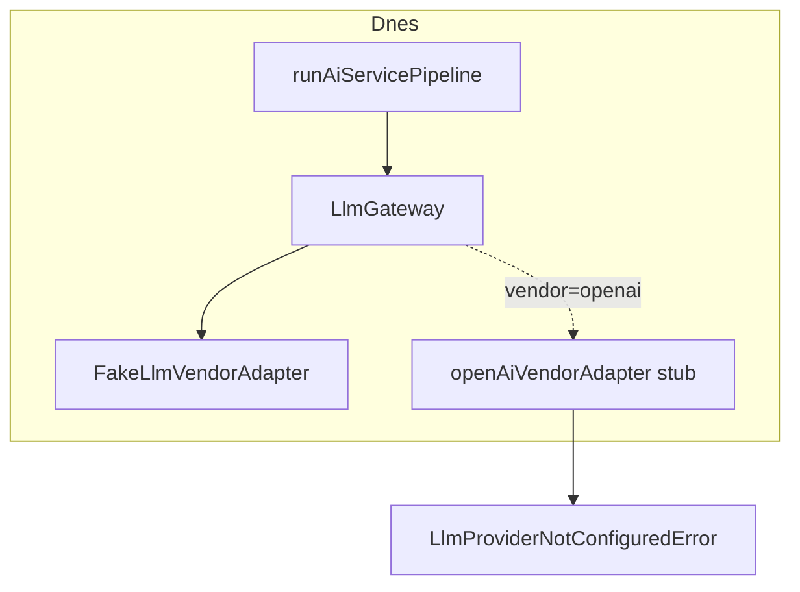

# Produkční LLM — vize a scope (Slice 12.11)

**Stav:** Odloženo — produkční vendor adaptéry nejsou implementovány  
**Datum:** 2026-06-28  
**Související:** [ADR-012](./adr/012-llm-adapter-architecture.md), [ADR-013](./adr/013-ai-contact-summary-service.md), [ADR-014](./adr/014-ai-recommendation-service.md), [IMPLEMENTATION_SEQUENCE.md](./IMPLEMENTATION_SEQUENCE.md)

## Rozhodnutí produktu (2026-06-28)

1. **Produkční modely se zatím neimplementují.** Runtime AI (Summary, Recommendation) běží přes **Fake LLM** v testech a lokálním vývoji s explicitní env konfigurací.
2. **První produkční transport** (až bude implementován) použije **OpenAI Responses API** — ne legacy Chat Completions API.
3. **Výběr modelu** probíhá výhradně přes existující **Model Registry** + **Model Policy** (`LLM_{PROFILE}_VENDOR` / `LLM_{PROFILE}_MODEL`). Žádný konkrétní model (např. `gpt-4o`) nesmí být natvrdo v adaptéru ani v dokumentaci jako jediná volba.

---

## Aktuální stav

| Vrstva | Stav |
|--------|------|
| `LlmGateway` + middleware (telemetry, cost) | Implementováno (Slice 11–13) |
| `FakeLlmVendorAdapter` | Implementováno — **jediný funkční adaptér** |
| OpenAI / Azure / Anthropic / Ollama adaptéry | Stub → `LlmProviderNotConfiguredError` |
| AI Summary + Recommendation pipeline | Funkční nad Fake LLM |
| Playwright / integrační testy | Fake LLM (env nebo `NODE_ENV=test`) |



---

## Cíl Slice 12.11 (až bude implementován)

Minimální produkční adaptér, který:

- Zapadne do stávající architektury **bez změn** `AiContactSummaryService`, `AiRecommendationService`, `runAiServicePipeline`
- Volá **OpenAI Responses API** (`client.responses.create`, ne `chat.completions.create`)
- Mapuje interní `LlmCompletionRequest` → Responses API `input` / `text.format` (structured JSON)
- Respektuje `request.model` z gateway (vendor + modelId z registry/policy — **ne hardcoded model**)
- Mapuje chyby SDK → hierarchie `LlmError`
- Nepersistuje `AiLog` — to zůstává v AI pipeline

### Transport: Responses API vs Chat Completions

| Aspekt | Chat Completions (legacy) | Responses API (cíl 12.11) |
|--------|---------------------------|---------------------------|
| SDK volání | `chat.completions.create` | `client.responses.create` |
| Vstup | `messages[]` | `input` (items / structured turn) |
| Structured JSON | `response_format: json_schema` | `text.format` / JSON schema v Responses API |
| Streaming | `stream: true` | `stream: true` na Responses — **mimo scope 12.11** |

Adaptér mapuje existující `LlmMessage[]` z prompt builderu do formátu Responses API. Business vrstva tento překlad nezná.

### Výběr modelu (povinné pravidlo)

Tok zůstává dle ADR-012:

```
LlmTaskProfile (SUMMARY | RECOMMENDATION | …)
  → resolveModelForTask()
  → getDefaultModelForProfile()  // čte LLM_{PROFILE}_VENDOR + LLM_{PROFILE}_MODEL
  → findLlmModelRegistryEntry()  // validace proti katalogu
  → LlmCompletionRequest.model
  → vendor adapter
```

- **Registry** ([`llm-model-registry.ts`](../src/features/ai/llm/models/llm-model-registry.ts)) = katalog dostupných modelů a capabilities
- **Policy** ([`resolve-model-for-task.ts`](../src/features/ai/llm/policy/resolve-model-for-task.ts)) = který záznam z registry použít pro daný task
- **Env** = runtime konfigurace bez redeploy (per-task profily)
- Business služby znají pouze `LlmTaskProfile`, nikdy konkrétní model ID

Přidání nového modelu = nový záznam v registry + env proměnné, **ne** změna adaptéru.

---

## In scope (Slice 12.11 — budoucí implementace)

- OpenAI vendor adaptér přes **Responses API**
- `complete()` + structured JSON pro Summary a Recommendation
- `OPENAI_API_KEY` (+ volitelně `OPENAI_BASE_URL`)
- Validace env modelu proti registry
- `AI_GATEWAY_TIMEOUT_MS` → `abortSignal` v pipeline
- Integrační testy adaptéru (mock SDK, bez live API v CI)
- Playwright **zůstává** na Fake LLM

## Out of scope (explicitně budoucí slice)

| Téma | Poznámka |
|------|----------|
| Multi-provider orchestrace / fallback chain | Až samostatný slice |
| Azure OpenAI / Anthropic / Ollama produkce | Stuby zůstávají |
| Streaming implementace | Interface existuje, implementace ne |
| Tool calling | Typy only |
| Retry / rate-limit middleware | Interface only |
| Background LLM queue | — |
| Prompt playground UI | — |
| Per-company DB model policy | SaaS slice |
| RAG / embeddings | — |

---

## Lokální vývoj a testování (dnes)

Fake LLM je určen **pro testy a lokální dev**, ne pro produkční provoz.

Doporučené env (viz [`.env.example`](../.env.example)):

```env
LLM_SUMMARY_VENDOR=fake
LLM_SUMMARY_MODEL=fake-1
LLM_RECOMMENDATION_VENDOR=fake
LLM_RECOMMENDATION_MODEL=fake-1
```

Playwright nastavuje Fake LLM v [`playwright.config.ts`](../playwright.config.ts).

Integrační testy načítají Fake LLM defaults přes [`tests/integration/setup-test-env.cjs`](../tests/integration/setup-test-env.cjs) (voláno z `npm run test:integration`).

Bez `LLM_*` env (mimo test) policy **nesmí** tiše fallbackovat na produkční vendor — konfigurace musí být explicitní.

---

## Definition of Done — Slice 12.11 (až implementace)

- [ ] `openAiVendorAdapter` volá **Responses API** při `OPENAI_API_KEY`
- [ ] Model z `LlmCompletionRequest.model` — validovaný registry, bez hardcoded model ID v kódu
- [ ] Summary + Recommendation projdou `completeStructured` s reálným JSON + Zod
- [ ] Chybějící klíč / neplatný registry záznam → srozumitelná `LlmError`
- [ ] Integrační testy (mock); CI bez live API
- [ ] Playwright zůstává Fake LLM
- [ ] Tento dokument aktualizován na stav **Implementováno**

---

## Troubleshooting (dnes)

| Symptom | Příčina | Řešení |
|---------|---------|--------|
| `LlmProviderNotConfiguredError` pro `openai` | Produkční adaptér je stub | Nastav `LLM_*_VENDOR=fake` nebo počkej na Slice 12.11 |
| AI panel negeneruje | Chybí `LLM_*` env | Doplň fake nebo budoucí produkční env |
| E2E AI testy padají | Fake LLM env | Ověř `playwright.config.ts` webServer env |
