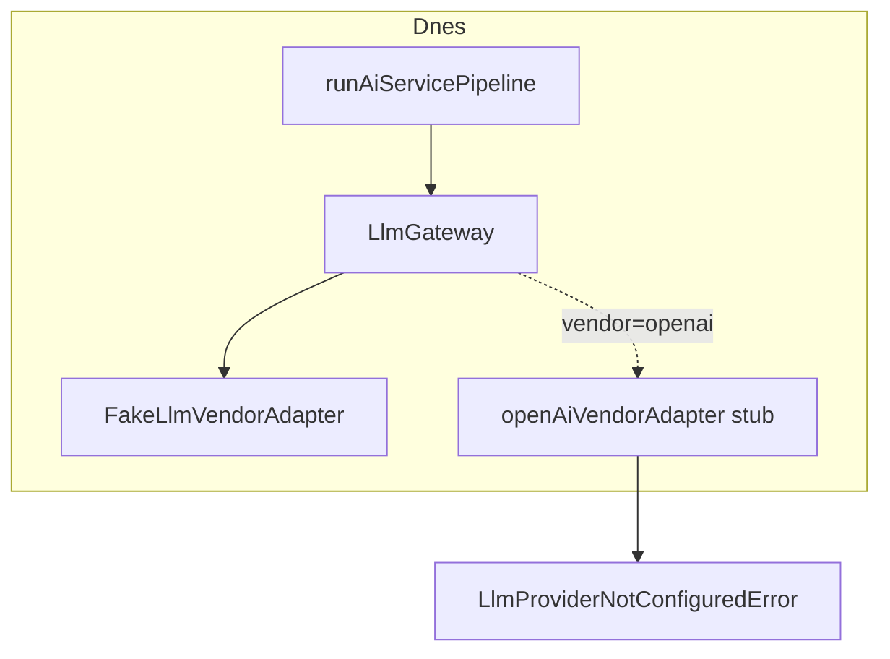

# Production AI Providers — vize a scope (Slice 18)

**Stav:** **Deferred** — produkční vendor adaptéry nejsou implementovány; plánováno po MVP  
**Datum:** 2026-06-28  
**Související:** [ADR-012](./adr/012-llm-adapter-architecture.md), [ADR-013](./adr/013-ai-contact-summary-service.md), [ADR-014](./adr/014-ai-recommendation-service.md), [IMPLEMENTATION_SEQUENCE.md](./IMPLEMENTATION_SEQUENCE.md)

## Rozhodnutí produktu (2026-06-28)

1. **Produkční modely se zatím neimplementují.** Runtime AI (Summary, Recommendation) běží přes **Fake LLM** — oficiální vývojový provider projektu (viz níže).
2. **První produkční transport** (až bude implementován) použije **OpenAI Responses API** — ne legacy Chat Completions API.
3. **Výběr modelu** probíhá výhradně přes existující **Model Registry** + **Model Policy** (`LLM_{PROFILE}_VENDOR` / `LLM_{PROFILE}_MODEL`). Adaptér **nerozhoduje** o modelu; žádný konkrétní produkční model není implicitní default v kódu.

---

## Decision rationale

Implementace produkčního LLM providera byla **záměrně odložena** (Deferred / planned after MVP). Nejde o zrušení funkcionality — platforma je připravena a produkční adaptéry vzniknou jako **samostatné budoucí slice** nad existujícím rozhraním `LlmVendorAdapter`.

### Důvody odkladu

| Důvod | Popis |
|-------|--------|
| **Náklady během vývoje** | Žádné API poplatky ani spotřeba tokenů při denním vývoji a ladění CRM. |
| **Deterministické testy** | Summary a Recommendation vrací předvídatelný JSON; golden testy a Zod validace jsou stabilní. |
| **CI bez internetu** | Integrační testy a Playwright nevolají externí API. |
| **CI bez API klíčů** | Žádné tajné klíče v GitHub Actions ani u vývojářů pro běžný pipeline. |
| **CI bez rate limitů** | Build a testy nejsou blokované kvótou poskytovatele. |
| **CRM před produkční AI** | Priorita: dokončit call workflow, reporting, segmentaci a další produktové slice před připojením placené inference. |
| **Čistá architektura** | Transport (adaptér) je oddělen od business pipeline; odklad nevyžaduje refactor Summary/Recommendation. |

### Co z odkladu **ne** plyne

- Platforma **je připravena** na produkční provider — `LlmGateway`, registry, policy, middleware, stub adaptéry.
- **Fake LLM zůstává** oficiálním development providerem (ne dočasný hack).
- Implementace OpenAI Responses API = **přidání nové implementace** `LlmVendorAdapter` + registrace ve vendor registry, bez změn `runAiServicePipeline` ani business služeb.

---

## Aktuální stav

| Vrstva | Stav |
|--------|------|
| `LlmGateway` + middleware (telemetry, cost) | Implementováno (Slice 11–13) |
| `FakeLlmVendorAdapter` | Implementováno — **oficiální development provider** (viz níže) |
| OpenAI / Azure / Anthropic / Ollama adaptéry | Stub → `LlmProviderNotConfiguredError` |
| AI Summary + Recommendation pipeline | Funkční nad Fake LLM |
| Playwright / integrační testy | Fake LLM (env nebo `NODE_ENV=test`) |



---

## Cíl Slice 18.1 (až bude implementován)

Minimální produkční adaptér, který:

- Zapadne do stávající architektury **bez změn** `AiContactSummaryService`, `AiRecommendationService`, `runAiServicePipeline`
- Volá **OpenAI Responses API** (`client.responses.create`, ne `chat.completions.create`)
- Mapuje interní `LlmCompletionRequest` → Responses API `input` / `text.format` (structured JSON)
- Respektuje `request.model` z gateway (vendor + modelId z registry/policy — **ne hardcoded model**)
- Mapuje chyby SDK → hierarchie `LlmError`
- Nepersistuje `AiLog` — to zůstává v AI pipeline

### Transport: Responses API vs Chat Completions

| Aspekt | Chat Completions (legacy) | Responses API (cíl 18.1) |
|--------|---------------------------|---------------------------|
| SDK volání | `chat.completions.create` | `client.responses.create` |
| Vstup | `messages[]` | `input` (items / structured turn) |
| Structured JSON | `response_format: json_schema` | `text.format` / JSON schema v Responses API |
| Streaming | `stream: true` | `stream: true` na Responses — **mimo scope 18.1** |

Adaptér mapuje existující `LlmMessage[]` z prompt builderu do formátu Responses API. Business vrstva tento překlad nezná.

### Výběr modelu (povinné pravidlo)

Tok zůstává dle ADR-012:

```
LlmTaskProfile (SUMMARY | RECOMMENDATION | …)
  → resolveModelForTask()          // policy — ne adaptér
  → getDefaultModelForProfile()    // čte LLM_{PROFILE}_VENDOR + LLM_{PROFILE}_MODEL
  → findLlmModelRegistryEntry()    // validace proti katalogu
  → LlmCompletionRequest.model
  → LlmVendorAdapter.complete*()   // adaptér pouze transport; model z requestu
```

- **Registry** ([`llm-model-registry.ts`](../src/features/ai/llm/models/llm-model-registry.ts)) = **katalog** dostupných modelů a capabilities (metadata, ne runtime default)
- **Policy** ([`resolve-model-for-task.ts`](../src/features/ai/llm/policy/resolve-model-for-task.ts)) = který záznam z registry použít pro daný task
- **Env** = runtime konfigurace bez redeploy (per-task profily)
- **Adaptér** = transport; **nikdy** nevolí `modelId` sám
- Business služby znají pouze `LlmTaskProfile`, nikdy konkrétní model ID

**Žádný implicitní produkční model:** `getDefaultModelForProfile()` vyžaduje explicitní `LLM_*` env, nebo v `NODE_ENV=test` deterministicky `fake:fake-1`. Katalog může obsahovat záznamy pro OpenAI/Anthropic/Ollama — výběr probíhá až přes env + policy.

Přidání nového modelu = nový záznam v registry + env proměnné, **ne** změna adaptéru.

---

## Production AI Providers — roadmap (Slice 18)

Milestone **Production AI Providers** — samostatný product slice nad hotovou AI platformou (Phase 1 uzavřena). **Neimplementováno.**

> **Číslování:** Slice **14** = Reporting, **15** = Tags, **16** = Dashboard v2, **17** = Automation. Provider adaptéry jsou výhradně **Slice 18** (pod-slice 18.1–18.4).

| Slice | Scope | Transport |
|-------|--------|-----------|
| **18.1** | OpenAI Responses Adapter | `client.responses.create`, structured JSON |
| **18.2** | Azure OpenAI Adapter | Azure-hosted Responses / chat compat dle ADR-012 |
| **18.3** | Anthropic Adapter | Messages API |
| **18.4** | Ollama Adapter | Lokální inference |

První implementace = **18.1** (OpenAI). Každý další provider = samostatný reviewable PR.

---

## In scope (Slice 18.1 — budoucí implementace)

- OpenAI vendor adaptér přes **Responses API**
- `complete()` + structured JSON pro Summary a Recommendation
- `OPENAI_API_KEY` (+ volitelně `OPENAI_BASE_URL`)
- Validace env modelu proti registry
- `AI_GATEWAY_TIMEOUT_MS` → `abortSignal` v pipeline
- Integrační testy adaptéru (mock SDK, bez live API v CI)
- Playwright **zůstává** na Fake LLM

## Out of scope (explicitně budoucí slice)

| Téma | Poznámka |
|------|----------|
| Multi-provider orchestrace / fallback chain | Až samostatný slice |
| Azure OpenAI / Anthropic / Ollama produkce | Stuby zůstávají |
| Streaming implementace | Interface existuje, implementace ne |
| Tool calling | Typy only |
| Retry / rate-limit middleware | Interface only |
| Background LLM queue | — |
| Prompt playground UI | — |
| Per-company DB model policy | SaaS slice |
| RAG / embeddings | — |

---

## Fake LLM — oficiální development provider

Fake LLM **není** pouze testovací náhrada. Je to **oficiální vývojový provider** projektu a zůstane podporovaný i po nasazení produkčních adaptérů.

| Použití | Mechanismus |
|---------|-------------|
| Lokální vývoj | `LLM_*_VENDOR=fake` v `.env` (viz `.env.example`) |
| Integrační testy | `tests/integration/setup-test-env.cjs` |
| Playwright / CI | `playwright.config.ts` webServer env |
| `NODE_ENV=test` | Deterministický fallback v `getDefaultModelForProfile()` |

Fake provider implementuje stejné `LlmVendorAdapter` rozhraní jako budoucí OpenAI/Azure/Anthropic/Ollama — business služby a pipeline se chovají identicky.

---

## Lokální vývoj a testování (dnes)

Doporučené env (viz [`.env.example`](../.env.example)):

```env
LLM_SUMMARY_VENDOR=fake
LLM_SUMMARY_MODEL=fake-1
LLM_RECOMMENDATION_VENDOR=fake
LLM_RECOMMENDATION_MODEL=fake-1
```

Playwright nastavuje Fake LLM v [`playwright.config.ts`](../playwright.config.ts).

Integrační testy načítají Fake LLM defaults přes [`tests/integration/setup-test-env.cjs`](../tests/integration/setup-test-env.cjs) (voláno z `npm run test:integration`).

Bez `LLM_*` env (mimo test) policy **nesmí** tiše fallbackovat na produkční vendor — konfigurace musí být explicitní.

---

## Definition of Done — Production AI Providers (až implementace)

- [ ] `openAiVendorAdapter` volá **Responses API** při `OPENAI_API_KEY`
- [ ] Model z `LlmCompletionRequest.model` — validovaný registry/policy, bez hardcoded model ID v adaptéru
- [ ] Summary + Recommendation projdou `completeStructured` s reálným JSON + Zod **bez změn business služeb**
- [ ] Chybějící klíč / neplatný registry záznam → srozumitelná `LlmError`
- [ ] Integrační testy adaptéru (mock SDK); CI bez live API
- [ ] Fake LLM zůstává plnohodnotným providerem pro dev/test/CI
- [ ] Tento dokument aktualizován na stav **Implementováno** pro daný provider slice

---

## Architektonické ověření (2026-06-28)

| Otázka | Odpověď |
|--------|---------|
| Je AI platforma připravena na produkční provider bez změn business služeb? | **Ano** — Summary/Recommendation používají `runAiServicePipeline` + `getLlmGateway()`; vendor je DI přes registry. |
| Stačí přidat novou `LlmVendorAdapter` implementaci? | **Ano** — registrace v `vendor-registry.ts`; žádná změna pipeline orchestrátoru. |
| Zůstává Fake LLM plnohodnotným providerem? | **Ano** — stejné rozhraní, podporovaný dlouhodobě. |
| Nevolné svázání s Fake nebo konkrétním modelem? | **Ne v business vrstvě.** Policy hint `preferLowCost` cílí na `fake:fake-1` — záměrné dev chování. Registry obsahuje katalog produkčních modelů; runtime výběr jen přes env. |

**Možné zobecnění (bez implementace):** `preferLowCost` by v budoucnu mohl vybírat nejlevnější záznam z registry místo hardcoded `fake:fake-1` — není blocker pro produkční adaptér.

---

## Troubleshooting (dnes)

| Symptom | Příčina | Řešení |
|---------|---------|--------|
| `LlmProviderNotConfiguredError` pro `openai` | Produkční adaptér je stub | Nastav `LLM_*_VENDOR=fake` nebo implementuj Slice 18.1 |
| AI panel negeneruje | Chybí `LLM_*` env | Doplň fake nebo budoucí produkční env |
| E2E AI testy padají | Fake LLM env | Ověř `playwright.config.ts` webServer env |
