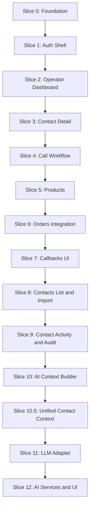

# Implementation Sequence

**Status:** Plán zavedení [TARGET_ARCHITECTURE.md](./TARGET_ARCHITECTURE.md)  
**Verze:** 1.0  
**Předpoklad:** Otevřená ADR v `docs/adr/` schválena před implementací dotčených částí.

Tento dokument definuje **bezpečné vertikální kroky** zavedení architektonického standardu. Každý krok doručuje funkční řez aplikace a neblokuje další vývoj.

---

## Principy pořadí

1. **Vertikální řezy** — každý krok končí ověřitelným chováním v prohlížeči nebo testu.
2. **Workflow před kosmetikou** — call orchestrátor před pokročilým reportingem.
3. **Tenant isolation od začátku** — každý nový modul musí projít checklistem z TARGET_ARCHITECTURE.
4. **ADR gate** — kroky závislé na otevřeném rozhodnutí jsou označeny a čekají na schválení ADR.
5. **Postupná repository vrstva** — nový kód přes repository; legacy `server/*.ts` refaktorovat při dotyku.

---

## Přehled fází



---

## Slice 0: Foundation

**Cíl:** Reprodukovatelné prostředí a sdílené domain building blocks.

### Úkoly

| # | Úkol | Výstup |
|---|------|--------|
| 0.1 | `npm install`, `prisma generate`, `prisma migrate dev` | Funkční DB |
| 0.2 | Seed script: `Company` + `ADMIN` (dle ADR-005) | Přihlásitelný admin |
| 0.3 | `src/domain/errors.ts` — typované doménové chyby | `ForbiddenError`, `NotFoundError`, `ValidationError` |
| 0.4 | `src/domain/events.ts` — audit action konstanty | Sdílené action kódy |
| 0.5 | Zod dependency + pattern pro `schemas.ts` | Validační standard |
| 0.6 | Aktualizace README — setup, env, architektura | Onboarding |

### Definition of Done

- [x] `npm run build` prochází
- [x] Seed script připraven (`npm run prisma:seed` po spuštění PostgreSQL)
- [x] Dokumentace setupu v README
- [x] Počáteční migrace v `prisma/migrations/`

### Závislosti

- **ADR-005** — forma seedu (jedna company vs. více)

---

## Slice 1: Auth Shell

**Cíl:** Přihlášení, odhlášení, chráněný CRM layout.

### Úkoly

| # | Úkol | Soubory (cíl) |
|---|------|----------------|
| 1.1 | Login page | `app/(auth)/login/page.tsx` |
| 1.2 | Login Server Action | `src/features/auth/actions.ts`, `schemas.ts` |
| 1.3 | Middleware — ochrana `(crm)/*` | `middleware.ts` |
| 1.4 | CRM layout s `requireCurrentUser` | `app/(crm)/layout.tsx` |
| 1.5 | Redirect `/` → dashboard nebo login | `app/page.tsx` |
| 1.6 | Logout action | `src/features/auth/actions.ts` |

### Vrstvy

```
LoginPage → loginAction → Auth.js signIn
(crm)/layout → requireCurrentUser → children
```

### Definition of Done

- [x] Nepřihlášený uživatel na `/dashboard` → redirect `/login`
- [x] Platné credentials → dashboard
- [x] Logout funguje

---

## Slice 2: Operator Dashboard

**Cíl:** První funkční CRM obrazovka — fronta práce operátora.

### Úkoly

| # | Úkol | Soubory (cíl) |
|---|------|----------------|
| 2.1 | Refaktor `queue.ts` → service + repository | `operator-queue/server/` |
| 2.2 | Action pro načtení fronty | `operator-queue/actions.ts` |
| 2.3 | Dashboard page | `app/(crm)/dashboard/page.tsx` |
| 2.4 | Zobrazení callbacků a leadů dle priority | UI komponenty |
| 2.5 | Manager: nepřiřazené leady + assign | actions + UI (role guard) |

### Vrstvy

```
dashboard/page.tsx → getOperatorQueueAction → queue.service → queue.repository → Prisma
```

### Definition of Done

- [x] Operátor vidí svou frontu
- [ ] Manager vidí nepřiřazené leady a může assignovat (odloženo — mimo scope Slice 2 request)
- [x] Tenant isolation test: operátor nevidí data jiné company — `tests/e2e/contacts/activity-tenant-isolation.spec.ts`

---

## Slice 3: Contact Detail

**Cíl:** Detail kontaktu s poznámkami a historií.

### Úkoly

| # | Úkol | Soubory (cíl) |
|---|------|----------------|
| 3.1 | Rozšířit contacts service: list, activity feed | `contacts/server/contacts.service.ts` |
| 3.2 | Contacts repository | `contacts/server/contacts.repository.ts` |
| 3.3 | Contact detail page | `app/(crm)/contacts/[contactId]/page.tsx` |
| 3.4 | Create note action | `notes/actions.ts` |
| 3.5 | Activity timeline (calls, notes, orders, callbacks) | read service / view model |

### Definition of Done

- [x] Detail kontaktu zobrazí základní data a poznámky
- [x] Operátor může přidat poznámku
- [x] Cross-tenant přístup k cizímu `contactId` vrátí 404 / NotFound

---

## Slice 4: Call Workflow

**Cíl:** Povinný outcome hovoru s transakčním orchestrátorem.

### Úkoly

| # | Úkol | Soubory (cíl) |
|---|------|----------------|
| 4.1 | `CallWorkflow` orchestrátor | `calls/server/call-workflow.ts` |
| 4.2 | Outcome side effects dle ADR-002, ADR-003 | v orchestrátoru |
| 4.3 | `completeCallAction` + schema | `calls/actions.ts`, `schemas.ts` |
| 4.4 | UI formulář outcome na contact detail | client component |
| 4.5 | Integrace s dashboard queue (next contact) | navigace po complete |
| 4.6 | Audit `call.completed` | `src/server/audit.ts` (základ) |

### ADR gate

- **ADR-002** — `CALL_LATER` vs `SCHEDULE_CALL`
- **ADR-003** — chování `FAIL`
- **ADR-001** — vliv na workflow stavy v UI

### Vrstvy

```
ContactPage → completeCallAction → CallWorkflow → services/repos → transaction + audit
```

### Definition of Done

- [x] Bez outcome nelze dokončit hovor
- [x] `ORDER` tlačítko viditelné, dokončení odloženo do Slice 6
- [x] Callback outcomes vytvoří callback dle schváleného ADR
- [x] Navigace „Back to queue" po dokončení hovoru
- [ ] Integrační test: všechny outcomes v transakci (Slice 9)

---

## Slice 5: Products

**Cíl:** Aktivní produktový katalog pro objednávky.

### Úkoly

| # | Úkol | Soubory (cíl) |
|---|------|----------------|
| 5.1 | Products service + repository | `products/server/` |
| 5.2 | CRUD actions (admin/manager) | `products/actions.ts` |
| 5.3 | Kategorie + produkty UI | `app/(crm)/products/` |
| 5.4 | Seed nebo admin UI pro první produkty | seed rozšíření |

### Definition of Done

- [ ] Admin může spravovat katalog
- [ ] Operátor vidí aktivní produkty při tvorbě objednávky
- [ ] Neaktivní produkt nelze objednat

---

## Slice 6: Orders Integration

**Cíl:** Objednávky propojené s call workflow.

### Úkoly

| # | Úkol | Soubory (cíl) |
|---|------|----------------|
| 6.1 | `OrderWorkflow` orchestrátor | `orders/server/order-workflow.ts` |
| 6.2 | Refaktor `orders.ts` → service + repository | `orders/server/` |
| 6.3 | `createOrderAction` + UI na contact detail | `orders/actions.ts` |
| 6.4 | Propojení `ORDER` outcome s OrderWorkflow | `call-workflow.ts` |
| 6.5 | Audit `order.created` | audit service |
| 6.6 | Order history na contact detail | read path |

### Definition of Done

- [ ] Objednávka vznikne z call flow nebo samostatného formuláře
- [ ] `ORDER` outcome bez objednávky není možný (po schválení pravidla)
- [ ] Order items validují produkty v rámci company

---

## Slice 7: Callbacks UI

**Cíl:** Plánování a správa callbacků mimo automatické outcome side effects.

### Úkoly

| # | Úkol | Soubory (cíl) |
|---|------|----------------|
| 7.1 | Refaktor callbacks → service + repository | `callbacks/server/` |
| 7.2 | create/update callback actions | `callbacks/actions.ts` |
| 7.3 | Callback list / kalendář view | `app/(crm)/callbacks/` |
| 7.4 | Callback status transitions (state machine) | callbacks.service |
| 7.5 | Audit callback events | audit service |

### Definition of Done

- [ ] Operátor může ručně naplánovat callback
- [ ] Due callbacky se objeví ve frontě
- [ ] Dokončený callback zmizí z fronty

---

## Slice 8: Contacts List and Import

**Cíl:** Seznam kontaktů, vyhledávání a CSV import.

### Úkoly

| # | Úkol | Soubory (cíl) |
|---|------|----------------|
| 8.1 | Contacts list + search + filter | `app/(crm)/contacts/page.tsx` |
| 8.2 | Create contact action + form | `contacts/actions.ts` |
| 8.3 | CSV import workflow | `contacts/server/import-workflow.ts` |
| 8.4 | Duplicate detection (phone/email per company) | již částečně v contacts |
| 8.5 | Bulk assign operátorům | manager action |
| 8.6 | Tags — pouze pokud ADR-004 schválí | schema + UI |

### ADR gate

- **ADR-004** — tags v tomto slice nebo později

### Definition of Done

- [ ] Manager importuje CSV s validací a deduplikací
- [ ] Contacts list filtruje podle status, source, priority
- [x] Import neporuší tenant isolation — E2E + tenant seed `seed-company-other`

---

## Slice 9: Contact Activity & Audit

**Cíl:** Jednotná append-only historie kontaktu + persistovaný audit; stránkovaná timeline; tenant testy a CI.

**ADR gate:** [ADR-009](./adr/009-contact-activity-and-audit.md)

### Úkoly

| # | Úkol | Soubory (cíl) | Commit |
|---|------|----------------|--------|
| 9.0 | ADR-009, update adr/README | `docs/adr/` | 1 |
| 9.1 | Prisma `ContactActivity`, `AuditEvent`, enums, migrace | `prisma/schema.prisma`, `src/domain/` | 2 |
| 9.2 | `recordContactBusinessEvent`, writers, audit persistence | `src/features/contacts/server/`, `src/server/audit.ts` | 3 |
| 9.3 | Wire all workflows (call, order, callback, note, contact, import) | workflow + service soubory | 4 |
| 9.4 | Paginated timeline read path + UI filters | `contact-activity.*`, timeline komponenty | 5 |
| 9.5 | E2E, tenant isolation tests, CI workflow | `tests/`, `.github/workflows/` | 6 |

### Commit plán

| # | Commit message |
|---|----------------|
| 1 | `docs(contacts): add ADR-009 contact activity and audit model` |
| 2 | `feat(activity): add ContactActivity and AuditEvent schema` |
| 3 | `feat(activity): add business event recorder and audit persistence` |
| 4 | `feat(activity): record events from all contact workflows` |
| 5 | `feat(contacts): paginated activity timeline with filters` |
| 6 | `test(contacts): activity E2E tenant isolation and CI` |

Každý commit: `build` + `lint` green; E2E od commitu 4.

### Definition of Done

- [x] Timeline čte z `ContactActivity` se stránkováním
- [x] Všechny kritické workflow zapisují activity + audit v transakci
- [x] ContactActivity se nečte pro business rozhodování (ADR-009)
- [x] Cross-tenant testy procházejí
- [x] CI běží na každý push
- [x] ADR-009 schváleno a implementace v souladu

---

## Slice 10: AI Context Builder

**Cíl:** Deterministická příprava strukturovaného AI kontextu kontaktu bez LLM integrace.

### Úkoly

| # | Úkol | Soubory (cíl) |
|---|------|----------------|
| 10.1 | ADR-010 — AI Context Architecture | `docs/adr/010-ai-context-architecture.md` |
| 10.2 | Context Providers + Provider Registry | `src/features/ai/context/providers/` |
| 10.3 | `ContactAiContextBuilder` + typy | `src/features/ai/context/` |
| 10.4 | `buildContactAiContext` service | `src/features/ai/server/contact-ai-context.service.ts` |
| 10.5 | Integrační testy (tenant isolation, determinismus) | `tests/integration/` |

### Vrstvy

```
buildContactAiContext → ContactAiContextBuilder → Context Providers → Repositories → Prisma
```

### Definition of Done

- [x] `ContactAiContext` je immutable read-only kontrakt
- [x] History čte výhradně z `ContactActivity`
- [x] Snapshot čte z business entit
- [x] Statistics Factory agreguje provider metadata bez dalších DB dotazů
- [x] Builder neobsahuje LLM ani AI logiku
- [x] Integrační testy procházejí

### Co Slice 10 neřeší

- LLM Adapter, prompty, AI UI (Slice 11)
- Unified contact detail loader (Slice 10.5)

---

## Slice 11: LLM Adapter Infrastructure

**Cíl:** Provider-agnostic transport vrstva mezi `ContactAiContext` a LLM API — bez AI funkcí a UI.

**ADR gate:** [ADR-012](./adr/012-llm-adapter-architecture.md)

### Úkoly

| # | Úkol | Soubory (cíl) |
|---|------|----------------|
| 11.1 | ADR-012 — LLM Adapter Architecture | `docs/adr/012-llm-adapter-architecture.md` |
| 11.2 | LLM typy, errors, vendor adapter interface | `src/features/ai/llm/types/`, `llm/errors/` |
| 11.3 | LlmGateway + middleware interface + model registry/policy | `src/features/ai/llm/gateway/`, `llm/models/`, `llm/policy/` |
| 11.4 | Fake vendor adapter + stub adaptéry | `src/features/ai/llm/adapters/` |
| 11.5 | Prompt template kontrakty + `PromptBuildInput` | `src/features/ai/prompts/` |
| 11.6 | Cost management kontrakty (no-op recorder) | `src/features/ai/llm/cost/` |
| 11.7 | Integrační testy (gateway + fake) | `tests/integration/` |

### Vrstvy

```
ContactAiContext → Prompt Builder → LlmRequestBuilder → LlmGateway → LlmVendorAdapter
```

### Definition of Done

- [x] ADR-012 schváleno a implementace v souladu
- [x] Business vrstva neimportuje vendor SDK
- [x] Model Policy odděleno od Model Registry
- [x] Gateway middleware interface připraven
- [x] `PromptBuildInput` nezakládá pouze na `ContactAiContext`
- [x] `FakeLlmVendorAdapter` + integrační testy procházejí
- [x] `ContactAiContext` / `ContactContext` beze změny

### Co Slice 11 neřeší

- OpenAI/Anthropic/Ollama API, AI Summary, UI (Slice 12)
- Streaming/tool calling implementace, retry/cache implementace

---

## Slice 12: AI Services and UI

**Cíl:** První AI funkce nad infrastrukturou — AI Contact Summary, AiLog integrace, contact detail panel. Vzorová implementace pro budoucí AI služby.

**ADR gate:** [ADR-013](./adr/013-ai-contact-summary-service.md)

### Úkoly

| # | Úkol | Soubory (cíl) |
|---|------|----------------|
| 12.0 | ADR-013 — AI Contact Summary Service + AI Service Pipeline | `docs/adr/013-ai-contact-summary-service.md` ✅ |
| 12.1 | **Platform Layer** — Registry (bohatá metadata), Config, Feature Flags, Metrics, Cache abstraction, **AI Service Pipeline** | `registry/`, `config/`, `flags/`, `metrics/`, `cache/`, `services/shared/` ✅ |
| 12.2 | **AiContactSummaryService** — první `AiTaskService` implementace | `services/contact-summary/` ✅ |
| 12.3 | **Prompt** — produkční `summary@v1`, napojení na `defaultPromptVersion` | `prompts/templates/summary/` |
| 12.4 | **Gateway** — pipeline → Fake adapter + `completeStructured` | `services/shared/ai-service-pipeline.ts` |
| 12.5 | **UI** — placeholder panel + Server Action | client component, `contact-summary.actions.ts` |
| 12.6 | **Cache** — `AiLogSummaryCacheStore` (fáze 1) | `services/contact-summary/` cache |
| 12.7 | **Telemetry** — Prompt Metrics z pipeline | `metrics/` |
| 12.8 | **Testy** — integrační + golden prompt | `tests/integration/` |
| 12.9 | AiLog migrace + `AiContextSanitizer` | Prisma, `context/sanitizers/` |
| 12.10 | První produkční vendor adapter | `llm/adapters/` |

### Platform vrstva (Slice 12)

```
AI Service Pipeline   → runAiServicePipeline() — jednotný životní cyklus
AI Service Registry   → descriptor s displayName, modelRequirements, supports*
AI Feature Flags      → ai.contact_summary, ai.contact_summary.refresh
AI Configuration      → cache TTL, timeout, sanitization defaults
Capability Matrix     → modelRequirements × ModelCapabilities + fallback
Prompt Metrics        → success rate, latency per prompt version
```

### Cache (dvoufázově)

| Fáze | Slice | Mechanismus |
|------|-------|-------------|
| 1 | 12 | AiLog jako cache source (`AiLogSummaryCacheStore`) |
| 2 | 12.5+ | `AiSummaryCache` tabulka (`PrismaSummaryCacheStore`) — viz ADR-013 |

### Předpoklad

- Slice 11 musí dodat `LlmGateway` a prompt kontrakty.

### Definition of Done — Platform Slice (12.1)

**Implementační disciplína:**
- Během 12.1 se **nemění** veřejné kontrakty Slice 10, 10.5, 11 — při nedostatku navrhnout ADR, ne tichý refactor
- Žádné `// TODO` — neimplementované cesty házejí `NotImplementedError` / `UnsupportedOperationError`
- Pipeline je deterministická — žádný `Date.now()`, `Math.random()`, UUID, `process.env` uvnitř orchestrace
- Pipeline nepoužívá singletony — vše přes `PipelinePorts`
- Capability Matrix je provider-agnostic — vendor logika pouze v `model-capabilities.ts`
- Registry je immutable (`Object.freeze`) — žádné runtime `register()`
- `services/shared/` nezná Summary — pouze generické typy

**Pravidlo nových abstrakcí:**
> Každá nová veřejná AI abstrakce musí mít pojmenovaného prvního i druhého budoucího konzumenta. Pokud ne, nepatří do platformy.

**Platform independence:**
- [x] Žádná business logika (Summary, DTO, sanitizer impl)
- [x] Žádný import z UI (`app/`, `components/`)
- [x] Žádný import z `features/contacts/` v platform adresářích (test `ai-platform-no-contacts-dependency`)
- [x] `runAiServicePipeline` generická s `PipelinePorts` DI
- [x] Immutable AI Service Registry (deskriptory pouze)
- [x] `AiCacheStore` interface (`cache/`)
- [x] 7 integračních testů platformy včetně smoke testu
- [x] `npm run build`, `npm run lint`, platform testy — pass

### Definition of Done — Slice 12.2 (AiContactSummaryService)

- [x] `ContactSummary` Zod schema + `SummaryViewModel` s `source: LIVE | CACHE`
- [x] `SanitizerProfile` enum (`SUMMARY`, `RECOMMENDATION`, `CALL_PREPARATION`, `EMAIL_DRAFT`, `SMS_DRAFT`) — implementován pouze `SUMMARY`
- [x] Sdílený `computeContactContextHash()` v `context/context-hash/` (ne v `contact-summary/`)
- [x] `AiContactSummaryService` implementuje `AiTaskService<ContactSummary, SummaryViewModel>`
- [x] Jediná factory `getContactSummaryService()` — žádné přímé `new AiContactSummaryService()` mimo factory
- [x] `createContactSummaryPipelinePorts()` skládá všechny porty (noop audit, in-memory cache)
- [x] `generateContactSummary()` executor volá `runAiServicePipeline`
- [x] Integrační test `contact-summary-service.test.ts` (bez DB)
- [x] `npm run build`, `npm run lint` — pass

### Definition of Done — Slice 12 (celý slice)

- [ ] Operátor vidí AI shrnutí na detailu kontaktu (feature flag `ai.contact_summary`)
- [ ] Výstupy uloženy v `AiLog` s prompt versioning a metadata
- [ ] PII v promptech ošetřena (`AiContextSanitizer` SUMMARY profile)
- [x] AI Service Pipeline (`runAiServicePipeline`) prochází integračním testem
- [x] AI Service Registry registruje `contact-summary` s plným descriptor metadata
- [x] Capability Matrix validuje model před LLM voláním
- [x] `AiCacheStore` interface připraven (fáze 1: AiLog impl v 12.6)

### Co Slice 12 neřeší

- Chat, Copilot, Streaming UI, RAG, `AiSummaryCache` tabulka (fáze 2)
- Per-company DB AI config (připraven merge v `resolveAiConfig`)

---

## Slice 10.5: Unified Contact Context Platform

**Cíl:** Sjednotit `getContactDetailView` a `buildContactAiContext` do jedné datové platformy (`ContactContext`) se sub-section granularitou.

**ADR gate:** [ADR-011](./adr/011-unified-contact-context-platform.md)

### Úkoly

| # | Úkol | Soubory (cíl) |
|---|------|----------------|
| 10.5.0 | ADR-011 | `docs/adr/` |
| 10.5.1 | `ContactContext` typy, sub-sections, presets | `src/features/contacts/context/types/` |
| 10.5.2 | Context Providers (přesun z ai/) | `src/features/contacts/context/providers/` |
| 10.5.3 | `ContactContextBuilder` | `src/features/contacts/context/contact-context.builder.ts` |
| 10.5.4 | `toContactAiContext` + AI wrapper | `ai/context/mappers/`, `ai/context/contact-ai-context.builder.ts` |
| 10.5.5 | Contact Detail + Callbacks panel z platformy | `contact-detail.service.ts`, `callbacks.service.ts` |
| 10.5.6 | Request cache + integrační testy | `contact-context.service.ts`, `tests/integration/` |

### Vrstvy

```
getContactDetailView → getContactContextForTenant → ContactContextBuilder → Providers → Repositories
buildContactAiContextForTenant → (wrapper) → ContactContextBuilder → toContactAiContext()
```

### Definition of Done

- [x] `ContactContext` je SSOT pro read data kontaktu
- [x] Contact Detail neimportuje `features/ai`
- [x] `buildContactAiContextForTenant` je tenký wrapper — Slice 10 AI kontrakt beze změny
- [x] Detail preset nenačítá products/orders/history/statistics
- [x] Duplicitní `listOpenCallbacksForContact` v callbacks panel odstraněna
- [x] Request-scoped cache (`React cache`) pro sdílený load
- [x] Integrační testy (partial load, tenant isolation, AI determinismus)

> Původní plán „Slice 10: AI V1“ byl rozdělen na Slice 10 (Context Builder), Slice 10.5 (Unified Platform), Slice 11 (LLM Adapter) a Slice 12 (AI Services/UI).

---

## Refactoring backlog (průběžně)

Tyto úkoly se provádějí při dotyku souvisejícího kódu, ne jako blok:

| Úkol | Priorita |
|------|----------|
| Přejmenovat `src/features/*/server/*.ts` na `*.service.ts` | Střední |
| Extrahovat Prisma dotazy do `*.repository.ts` | Střední |
| Odstranit nebo zdokumentovat unused Auth.js DB modely (`Session`, `Account`) | Nízká |
| `User.email` → `@@unique([companyId, email])` pro SaaS | Před Phase 11 |
| Supabase RLS policies | Před multi-tenant produkcí |
| JWT refresh strategie pro role changes | Production Hardening slice |
| `src/server/tenant.ts` assert helpery | Production Hardening slice |

---

## Checklist pro každý nový slice

Před merge každého slice ověřit:

- [ ] Vrstvy dodrženy (UI → Actions → Workflow/Service → Repository → Prisma)
- [ ] Všechny dotazy tenant-scoped
- [ ] Zod schema pro každou mutaci
- [ ] Role guards aplikovány
- [ ] Audit eventy pro kritické akce
- [ ] ContactActivity zapisována přes `recordContactBusinessEvent` (od Slice 9)
- [ ] ContactActivity se nečte pro business rozhodování (ADR-009)
- [ ] `revalidatePath` / cache invalidation
- [ ] Otevřená ADR neporušena
- [ ] Alespoň jeden test tenant isolation (od Slice 2)

---

## Mapování na ROADMAP.md

| Roadmap fáze | Implementation slice |
|--------------|---------------------|
| Phase 0 | Slice 0 |
| Phase 1 | Slice 1 |
| Phase 2 | Slice 2 |
| Phase 3 | Slice 3, 8 |
| Phase 4 | Slice 8 |
| Phase 5 | Slice 4 |
| Phase 6 | Slice 7 |
| Phase 7 | Slice 5 |
| Phase 8 | Slice 6 |
| Phase 9 | Slice 10 + 10.5 (AI Context + Platform) |
| Phase 10 | Slice 11 (LLM Adapter) |
| Phase 11 | Slice 12 (AI Services / UI) |
| Phase 12 | Reporting — nový slice |
| Phase 11 | Po MVP (SaaS foundation) |

---

## Související dokumenty

- [TARGET_ARCHITECTURE.md](./TARGET_ARCHITECTURE.md)
- [adr/README.md](./adr/README.md)
- [ROADMAP.md](./ROADMAP.md)
