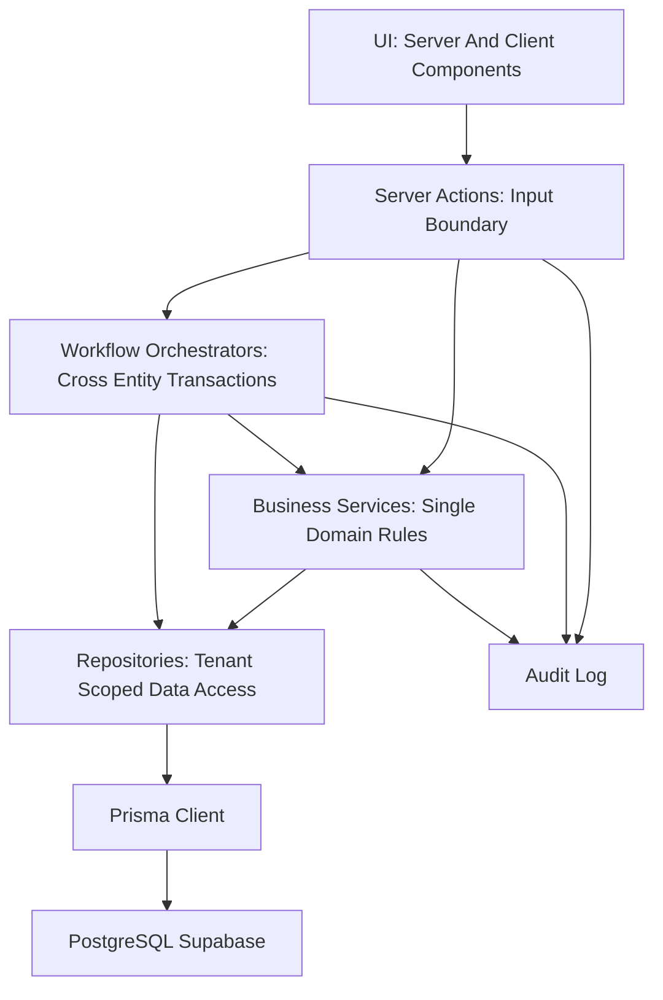
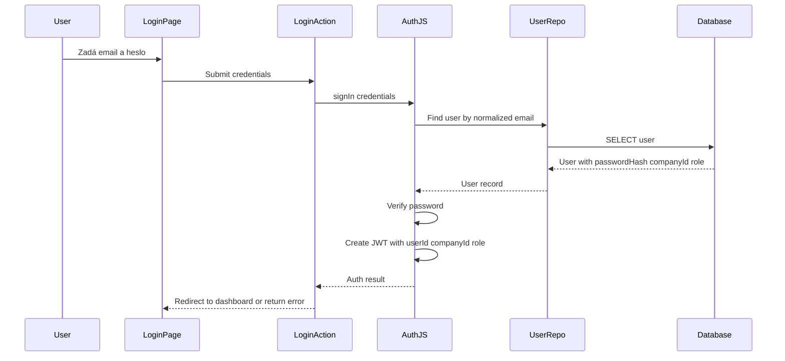
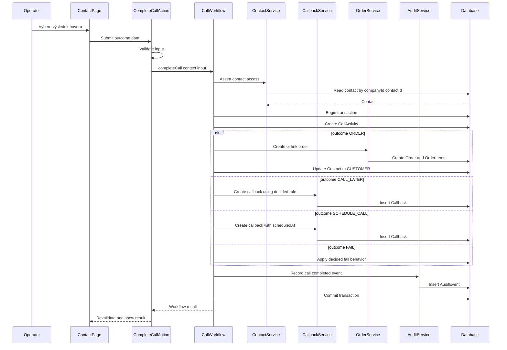
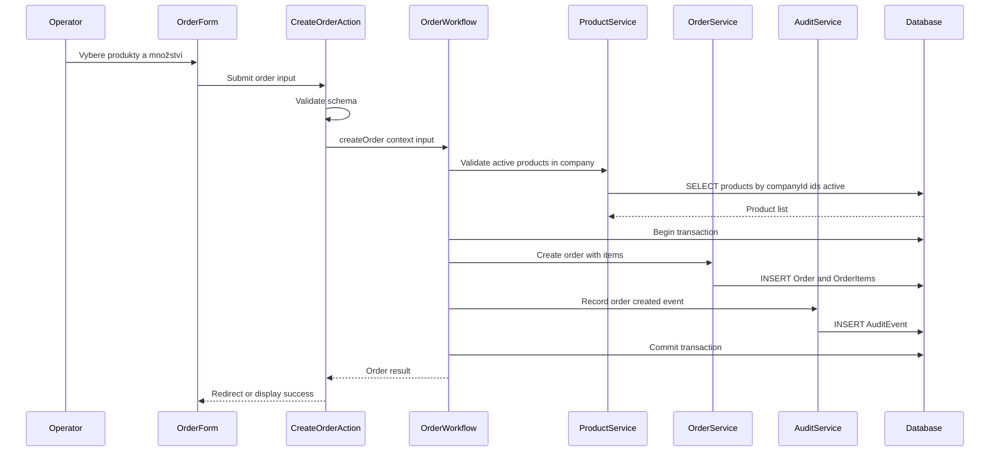
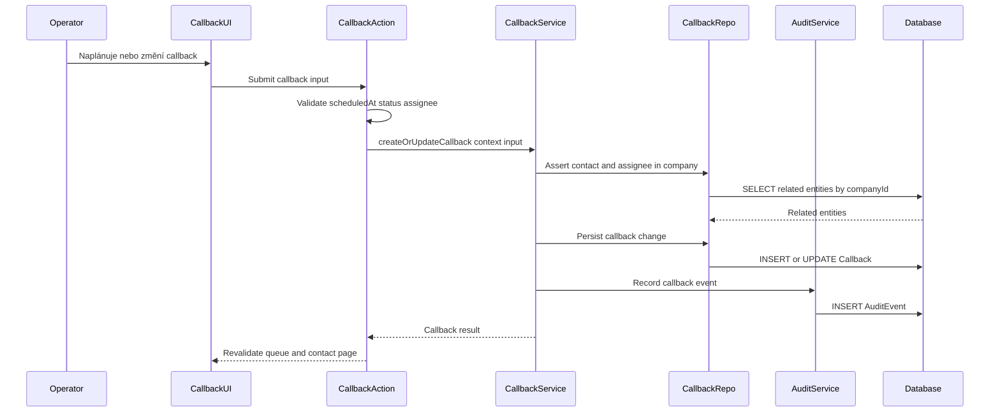

# Velocity CRM — Target Architecture

**Status:** Závazný architektonický standard  
**Verze:** 1.0  
**Související dokumenty:** [ARCHITECTURE_RULES.md](./ARCHITECTURE_RULES.md), [PROJECT_VISION.md](./PROJECT_VISION.md), [ROADMAP.md](./ROADMAP.md), [adr/README.md](./adr/README.md), [IMPLEMENTATION_SEQUENCE.md](./IMPLEMENTATION_SEQUENCE.md)

---

## Účel a rozsah

Tento dokument definuje závazný architektonický standard pro Velocity CRM. Cílem je udržet MVP jednoduché, ale připravené na budoucí SaaS rozšíření, AI asistenta a reporting bez zásadního přepisování jádra.

### Základní invarianty

- `Contact` je jediná zákaznická/lead entita. Nevzniká samostatný `Lead` ani `Customer` model.
- Každá business entita patří pod `Company` přes `companyId`.
- Každý přístup k datům je tenant-scoped.
- Operátor musí po hovoru zvolit právě jeden výsledek: `ORDER`, `CALL_LATER`, `SCHEDULE_CALL`, `FAIL`.
- Server Actions jsou primární aplikační hranice pro UI. Custom API routes jsou výjimka pro Auth.js, webhooks a externí integrace.
- Business logika nesmí být v React komponentách.

### Otevřená rozhodnutí

Následující témata nejsou v tomto dokumentu předpokládána jako vyřešená. Každé má vlastní ADR v `docs/adr/` s variantami, výhodami a nevýhodami. Finální rozhodnutí se schvaluje společně.

**Schválená workflow pravidla:** [WORKFLOW_RULES.md](./WORKFLOW_RULES.md)


| Téma                             | ADR                                                                                        |
| -------------------------------- | ------------------------------------------------------------------------------------------ |
| Lead workflow vs. Contact status | [adr/001-lead-workflow-model.md](./adr/001-lead-workflow-model.md)                         |
| `CALL_LATER` vs. `SCHEDULE_CALL` | [adr/002-call-outcome-callback-semantics.md](./adr/002-call-outcome-callback-semantics.md) |
| Chování outcome `FAIL`           | [adr/003-fail-outcome-behavior.md](./adr/003-fail-outcome-behavior.md)                     |
| Tags u kontaktů                  | [adr/004-contact-tags-scope.md](./adr/004-contact-tags-scope.md)                           |
| SaaS bootstrap pro V1            | [adr/005-saas-bootstrap-v1.md](./adr/005-saas-bootstrap-v1.md)                             |


---

## Cílové vrstvy

Architektura je vrstvená a feature-oriented. Feature může mít vlastní UI, actions, workflow, services a repositories, ale směr závislostí je vždy shora dolů.




### UI vrstva

**Odpovědnosti:**

- Renderuje stránky, layouty, formuláře a stavy.
- Preferuje Server Components pro čtení dat.
- Používá Client Components pouze pro interaktivní formuláře, lokální UI state a progresivní UX.
- Nikdy neobsahuje business pravidla, tenant filtraci ani přímé Prisma volání.
- Volá pouze Server Actions nebo čte data přes serverové page/load funkce delegující do services.

**Pravidla:**

- UI nesmí importovat `src/server/db.ts`.
- UI nesmí přímo importovat repository.
- UI smí znát view modely, ne databázové detaily.
- UI chyby mají být mapované z doménových/action chyb, ne z raw `Error` textů.

### Server Actions vrstva

**Odpovědnosti:**

- Je veřejná aplikační hranice pro formuláře a mutace.
- Získá aktuálního uživatele přes auth guard.
- Validuje vstup (Zod schema).
- Normalizuje data z formulářů.
- Volá service nebo workflow orchestrátor.
- Mapuje doménové chyby na UI-friendly výsledek.
- Invaliduje cache / revaliduje routes podle potřeby.

**Pravidla:**

- Server Actions nesmí obsahovat složité business rozhodování.
- Server Actions nesmí skládat více repository operací přímo, pokud jde o business workflow.
- Každá public mutace musí mít validační schema.
- Každá mutace musí být tenant-aware přes session context.

### Workflow vrstva

**Odpovědnosti:**

- Řídí cross-entity business procesy.
- Vynucuje transakční konzistenci.
- Koordinuje více services/repositories.
- Je vhodná pro call completion, order creation tied to call, callback scheduling a budoucí AI context generation.

**Pravidla:**

- Workflow může používat transakci (`prisma.$transaction`).
- Workflow musí být idempotentní tam, kde to dává produktově smysl.
- Workflow nesmí přijímat `companyId` z klienta. Bere ho pouze z trusted session context.
- Workflow vrací domain/view výsledek, ne raw Prisma graf, pokud by tím unikal interní model.

**Klíčové orchestrátory:**


| Orchestrátor    | Soubor (cíl)                                   | Odpovědnost                              |
| --------------- | ---------------------------------------------- | ---------------------------------------- |
| `CallWorkflow`  | `src/features/calls/server/call-workflow.ts`   | Dokončení hovoru + side effects          |
| `OrderWorkflow` | `src/features/orders/server/order-workflow.ts` | Vytvoření objednávky s validací produktů |


### Business Services vrstva

**Odpovědnosti:**

- Obsahuje pravidla jedné doménové oblasti.
- Například `ContactsService`, `OrdersService`, `CallbacksService`, `UsersService`, `ProductsService`.
- Kontroluje role, ownership a doménové invarianty.
- Připravuje data pro repository.

**Pravidla:**

- Service může volat repository stejné domény.
- Service by neměla volat Server Actions.
- Cross-domain side effects patří do workflow vrstvy, ne do jedné service.
- Service nesmí důvěřovat klientským hodnotám pro tenant nebo role.

**Migrace z existujícího kódu:**

Současné soubory `src/features/*/server/*.ts` fungují jako předběžné services. Při refaktoru se přejmenují na `*.service.ts` a Prisma dotazy se přesunou do `*.repository.ts`.

### Repository vrstva

**Odpovědnosti:**

- Izoluje Prisma dotazy.
- Vynucuje tenant-scoped přístup na query úrovni.
- Poskytuje explicitní metody jako `findContactByIdForCompany`, `createOrderForCompany`, `listDueCallbacksForOperator`.
- Skrývá technické detaily Prisma `where` struktur.

**Pravidla:**

- Každá repository metoda pro business entitu musí přijímat trusted `companyId` nebo tenant context.
- Repository nikdy nečte `companyId` z user input objektu.
- Cross-tenant dotazy jsou zakázané mimo explicitní systémové/admin operace, které zatím nejsou v MVP.
- Repository vrací data v nejmenším potřebném rozsahu.

### Prisma vrstva

**Odpovědnosti:**

- Technický ORM přístup k databázi.
- V MVP používá `src/server/db.ts` singleton s `@prisma/adapter-pg`.
- Do budoucna může být obalena tenant-scoped helperem (`src/server/tenant.ts`) nebo Prisma extension.

**Pravidla:**

- Přímé Prisma volání smí být pouze v repositories nebo dočasně v existujících server services, dokud nebude repository vrstva zavedena.
- Nový kód směřuje přes repository/service hranici.
- Prisma schema je zdroj pravdy pro relační model, ne pro celý business workflow.

---

## Doporučená struktura složek

```text
app/
  (auth)/
    login/
      page.tsx
  (crm)/
    layout.tsx
    dashboard/
      page.tsx
    contacts/
      page.tsx
      [contactId]/
        page.tsx
    calls/
    callbacks/
    products/
    orders/
  api/
    auth/[...nextauth]/route.ts

src/
  domain/
    auth.ts
    errors.ts
    events.ts
  server/
    auth.ts
    db.ts
    tenant.ts
    audit.ts
    auth/
      guards.ts
  features/
    contacts/
      actions.ts
      schemas.ts
      server/
        contacts.service.ts
        contacts.repository.ts
    calls/
      actions.ts
      schemas.ts
      server/
        calls.service.ts
        call-workflow.ts
        calls.repository.ts
    callbacks/
      actions.ts
      schemas.ts
      server/
        callbacks.service.ts
        callbacks.repository.ts
    orders/
      actions.ts
      schemas.ts
      server/
        orders.service.ts
        order-workflow.ts
        orders.repository.ts
    products/
      actions.ts
      schemas.ts
      server/
        products.service.ts
        products.repository.ts
    users/
      actions.ts
      schemas.ts
      server/
        users.service.ts
        users.repository.ts
    operator-queue/
      actions.ts
      schemas.ts
      server/
        queue.service.ts
        queue.repository.ts
    ai/
      context/
        contact-ai-context.builder.ts
        providers/
        statistics/
        types/
      server/
        ai-log.ts
        contact-ai-context.service.ts
```

**MVP zjednodušení:** Nejdřív `actions.ts`, `schemas.ts` a `server/*.ts`. Repository vrstvu lze zavádět postupně u nového kódu a při refaktoru rizikových dotazů.

---

## Pravidla komunikace mezi vrstvami

### Povolené směry

- UI → Server Actions
- Server Actions → Workflow nebo Business Services
- Workflow → Business Services a Repositories
- Business Services → Repositories
- Repositories → Prisma
- Workflow / Services / Actions → Audit service

### Zakázané směry

- UI → Prisma
- UI → Repository
- Repository → UI nebo Server Actions
- Prisma → Business logic
- Feature UI jedné domény → server internals jiné domény
- Cross-feature side effects bez workflow orchestrátoru

---

## Tenant isolation standard

Každá business operace musí začít trusted contextem:

```typescript
type TenantContext = {
  userId: string;
  companyId: string;
  role: AppUserRole;
  email?: string | null;
  name?: string | null;
};
```

**Pravidla:**

- `companyId` nikdy nepřichází z formuláře ani URL jako zdroj pravdy.
- Každý read/write dotaz na business entitu musí obsahovat `companyId` filtr.
- Každý vztahový write musí ověřit, že všechny související entity patří do stejné `Company`.
- Repository metody musí mít tenant-scoped názvy nebo přijímat explicitní tenant context.
- Cross-tenant admin funkce nejsou součást MVP.

**Postup zralosti:**


| Fáze                        | Přístup                                                             |
| --------------------------- | ------------------------------------------------------------------- |
| MVP                         | Ruční `companyId` scoping + integrační testy                        |
| Stabilizace                 | Repository helpery a sdílené `assertCompanyEntity` funkce           |
| SaaS                        | Prisma extension nebo tenant-scoped client (`src/server/tenant.ts`) |
| Produkce (silný SaaS nárok) | Supabase RLS policies jako defense-in-depth                         |


**Sdílené assert helpery (cíl):**

```typescript
// src/server/tenant.ts — konceptuální API
assertContactInCompany(companyId, contactId)
assertUserInCompany(companyId, userId)
assertProductInCompany(companyId, productId)
```

---

## Validace standard

Validace patří na public boundary: Server Actions a případné API routes.

**Pravidla:**

- Každý formulářový vstup má Zod schema v `src/features/<feature>/schemas.ts`.
- Schema normalizuje emaily, trimuje texty a kontroluje povinné hodnoty.
- Business services znovu ověřují invarianty, které nelze bezpečně validovat pouze na vstupu.
- Repository nevaliduje business pravidla, pouze chrání datový přístup.
- Hodnoty enumů se validují explicitně (`z.nativeEnum` nebo `z.enum`).
- Číselné hodnoty jako `quantity` a `unitPrice` musí mít doménová omezení (`quantity > 0`, kladná cena).

**Vzor Server Action:**

```typescript
// Konceptuální — ne implementace
export async function createContactAction(formData: FormData) {
  const user = await requireCurrentUser();
  const parsed = createContactSchema.safeParse(Object.fromEntries(formData));
  if (!parsed.success) return { ok: false, errors: parsed.error.flatten() };
  const contact = await contactsService.create(user, parsed.data);
  revalidatePath("/contacts");
  return { ok: true, data: contact };
}
```

---

## Audit log standard

Audit log je **oddělen** od `AiLog`. `AiLog` slouží pro AI výstupy; obecný audit eviduje bezpečnostní a business operace.

### Co auditovat (MVP nebo brzy po něm)


| Událost                        | Action kód (návrh)                          |
| ------------------------------ | ------------------------------------------- |
| Přihlášení (success/failure)   | `auth.login.success` / `auth.login.failure` |
| Vytvoření uživatele            | `user.created`                              |
| Změna role uživatele           | `user.role_changed`                         |
| Přiřazení kontaktu operátorovi | `contact.assigned`                          |
| Dokončení hovoru               | `call.completed`                            |
| Vytvoření objednávky           | `order.created`                             |
| Změna stavu objednávky         | `order.status_changed`                      |
| Vytvoření callbacku            | `callback.created`                          |
| Změna callbacku                | `callback.updated`                          |
| AI generování                  | `ai.generated`                              |


### Struktura audit eventu (cílový model)

```typescript
type AuditEvent = {
  companyId: string;
  actorUserId: string;
  action: string;
  entityType: string;
  entityId: string;
  metadata?: Record<string, unknown>;
  createdAt: Date;
};
```

**Pravidla:**

- Audit nesmí obsahovat hesla ani celé prompty s PII, pokud to není výslovně potřeba a ošetřeno.
- Kritické audit eventy u call/order workflow jsou součástí hlavní transakce.
- Méně kritické audit eventy (např. login failure) mohou být mimo transakci.
- Audit musí být tenant-scoped.

**Implementace:** `src/server/audit.ts` — sdílená služba volaná z workflow a services.

---

## Transakční orchestrátor

Core workflow je řízeno orchestrátorem, ne rozptýleno v několika action/service funkcích.

### CallWorkflow — algoritmus

1. Přijme `TenantContext` a validovaný input.
2. Ověří kontakt v rámci `companyId`.
3. Ověří oprávnění operátora k danému kontaktu (assigned nebo admin/manager).
4. Podle `outcome` vynutí potřebná doplňková data (objednávka, `scheduledAt`, …).
5. Spustí `prisma.$transaction`.
6. Vytvoří `CallActivity`.
7. Podle outcome provede side effects (viz tabulka níže).
8. Zapíše audit event `call.completed`.
9. Commit a vrácení výsledku pro UI.

### Outcome side effects (návrh — závisí na ADR)


| Outcome         | Side effects (návrh k rozhodnutí)                                                               |
| --------------- | ----------------------------------------------------------------------------------------------- |
| `ORDER`         | Vytvořit nebo propojit objednávku; `Contact.status` → `CUSTOMER`; související callback → `DONE` |
| `CALL_LATER`    | Vytvořit callback podle rozhodnuté default logiky (ADR-002)                                     |
| `SCHEDULE_CALL` | Vytvořit callback s explicitním `scheduledAt`                                                   |
| `FAIL`          | Chování dle ADR-003                                                                             |


### OrderWorkflow — algoritmus

1. Přijme `TenantContext` a validovaný input.
2. Ověří kontakt v `companyId`.
3. Ověří aktivní produkty v `companyId`.
4. Transakce: vytvoření `Order` + `OrderItem[]`.
5. Audit event `order.created`.
6. Commit a vrácení výsledku.

---

## Hlavní workflow diagramy

### Login




### Zpracování hovoru




### Vytvoření objednávky




### Callback




---

## Zásady pro přidávání nových funkcí

Každá nová funkce musí před implementací odpovědět:

1. Jaké entity čte a zapisuje?
2. Jak je zajištěn `companyId` scope?
3. Které role ji mohou provést?
4. Je to single-domain service, nebo cross-domain workflow?
5. Jaká validační schema potřebuje?
6. Jaké audit eventy vznikají?
7. Jaké cache/routes se mají revalidovat?
8. Jaké testy chrání tenant isolation a hlavní business pravidla?

**Pravidla:**

- Začít od doménového workflow, ne od UI detailů.
- Nepřidávat model, pokud lze použít existující `Contact` a status/workflow metadata.
- Nepřidávat dependency bez jasného důvodu.
- Nepřidávat custom API route, pokud stačí Server Action.
- Každý nový modul musí mít jasnou hranici odpovědnosti.
- Cross-feature logika patří do workflow orchestrátoru.

---

## MVP architektonický cíl

MVP obsahuje minimální, ale end-to-end funkční osu:

- Login a protected CRM shell
- Operator dashboard s frontou práce (`operator-queue`)
- Contacts list/detail
- Call workflow s povinným outcome
- Callback vytvoření a dokončení
- Products — základ pro aktivní katalog
- Orders vytvořené z call workflow nebo navázané na kontakt
- Notes a activity timeline
- AI V1 až nad reálnými daty historie

Detailní pořadí implementace: [IMPLEMENTATION_SEQUENCE.md](./IMPLEMENTATION_SEQUENCE.md).

---

## Budoucí rozšíření

Budoucí SaaS a AI rozšíření staví na stejných hranicích:

- Company management a settings jako samostatná feature
- Audit log jako first-class systémová entita (Prisma model `AuditEvent`)
- Billing/subscriptions pod `Company`, ne v user modelu
- Reporting nad read modely nebo optimalizovanými query services
- AI context service sestavující data z contacts, notes, calls, orders a callbacks
- AI prompt/output audit odděleně od obecného audit logu
- Integrace přes API routes/webhooks až ve fázi integrací (Roadmap Phase 14)


Auth je výjimka z běžné architektury. Middleware běží na Edge Runtime, proto používá `auth.edge.ts`, který nesmí záviset na Prisma. Sdílená konfigurace je v `auth.config.ts`.

---

## Vztah k ostatním dokumentům


| Dokument                                  | Role                                           |
| ----------------------------------------- | ---------------------------------------------- |
| `PROJECT_VISION.md`                       | Produktová vize a MVP rozsah                   |
| `ARCHITECTURE_RULES.md`                   | Stručná pravidla a stack                       |
| `TARGET_ARCHITECTURE.md` (tento dokument) | Závazný layered standard                       |
| `ROADMAP.md`                              | Fázové doručení funkcí                         |
| `docs/adr/*.md`                           | Otevřená a uzavřená architektonická rozhodnutí |
| `IMPLEMENTATION_SEQUENCE.md`              | Pořadí zavedení standardu do kódu              |


