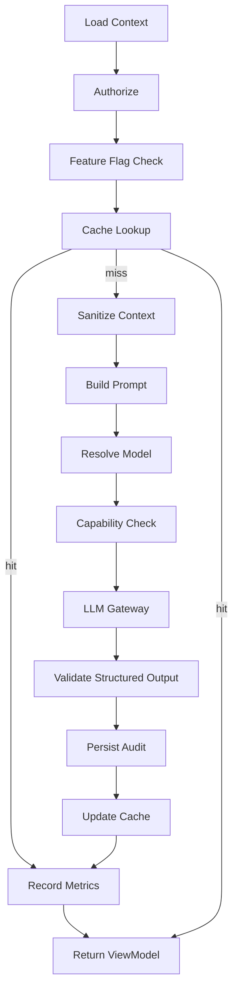
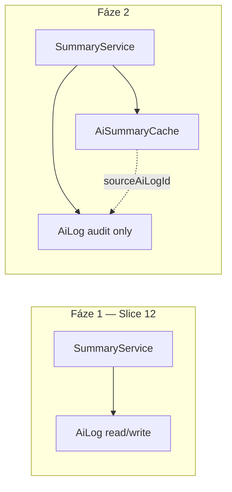

# ADR-013: AI Contact Summary Service

**Stav:** Přijato  
**Datum:** 2026-06-21  
**Schváleno:** 2026-06-21  
**Související:** [ADR-010](./010-ai-context-architecture.md), [ADR-011](./011-unified-contact-context-platform.md), [ADR-012](./012-llm-adapter-architecture.md), [IMPLEMENTATION_SEQUENCE.md](../IMPLEMENTATION_SEQUENCE.md), [TARGET_ARCHITECTURE.md](../TARGET_ARCHITECTURE.md)

## Kontext

Slice 11 (ADR-012) dodal provider-agnostic LLM infrastrukturu: `LlmGateway`, vendor adaptéry, prompt kontrakty, model policy. Slice 12 je první slice, který tuto infrastrukturu **skutečně používá** — funkcí **AI Contact Summary**.

Architektonický návrh Slice 12 prošel review. Před implementací byly doplněny cross-cutting concerny, které zajistí škálovatelnost pro budoucí AI služby (Recommendation, Copilot, …) bez redesignu infrastruktury:

- **AI Service Pipeline** — jednotný životní cyklus všech AI business služeb
- **AI Service Registry** — centrální katalog AI business služeb (s bohatými metadaty)
- **AI Feature Flags** — řízení dostupnosti funkcí per tenant / role
- **Centrální AI Configuration** — jednotný zdroj pravdy pro modely, limity, cache
- **Prompt Metrics** — observabilita promptů a výstupů
- **AI Capability Matrix** — co který model / vendor / task umí
- **Dlouhodobý plán oddělení `AiSummaryCache` od `AiLog`**

Slice 12 staví na uzavřených kontraktech ADR-010, ADR-011, ADR-012. **Nemění** `ContactAiContext`, `ContactContext` ani `LlmGateway` API.

## Rozhodnutí

### Cíl Slice 12

První end-to-end AI funkcionalita:

```
Operátor otevře kontakt
  → ContactContext → ContactAiContext
  → AiContextSanitizer → Prompt Builder (summary@vN)
  → LlmGateway → LLM
  → ContactSummary DTO → AiLog → SummaryViewModel → UI panel
```

Slice 12 **neimplementuje**: Chat UI, Streaming UI, Copilot, Tool Calling, RAG, Embeddings, Vector DB, Multi-agent, AI Workflow Engine.

### Vzorová architektura AI Service

Každá budoucí AI funkce přidá **novou složku v `services/`**, prompt template a DTO — ne změny gateway ani context platformy.

```
src/features/ai/
  config/              # centrální AI Configuration (Slice 12)
  registry/            # AI Service Registry + Capability Matrix (Slice 12)
  metrics/             # Prompt Metrics (Slice 12 — kontrakty + no-op)
  flags/               # AI Feature Flags (Slice 12)
  services/
    shared/            # AI Service Pipeline — společný orchestration skeleton
    contact-summary/   # první implementace — vzor pro ostatní
  context/sanitizers/
  server/
    contact-summary.actions.ts
    ai-log.service.ts
```

---

## AI Service Pipeline

### Problém

Bez jednotného životního cyklu by každá nová AI služba (Summary, Recommendation, Email Draft, Copilot) znovu implementovala auth, cache, sanitizaci, capability check a audit. Slice 12 má být **vzor** — ne jednorázová funkce.

### Rozhodnutí

Každá AI business služba prochází stejným **AI Service Pipeline**. Konkrétní služba implementuje pouze task-specific hooky (DTO schema, sanitizer profile, cache key, ViewModel mapper). Společný skeleton žije v `services/shared/`.

### Standardní průchod

```text
1.  Load Context          ContactContext → ContactAiContext
2.  Authorize             assertContactAccess + minRole z registry
3.  Feature Flag Check    descriptor.featureFlag
4.  Cache Lookup          cache store (skip pokud force: true)
5.  Sanitize Context      AiContextSanitizer (task profile)
6.  Build Prompt          resolvePromptTemplate(descriptor.defaultPromptVersion)
7.  Resolve Model         resolveModelForTask + AI Config overrides
8.  Capability Check      Capability Matrix — service requirements × model
9.  LLM Gateway           completeStructured | complete | stream (budoucí)
10. Validate Output       Zod / schema pro task DTO
11. Persist Audit         AiLog (SUCCESS | FAILED)
12. Update Cache          cache store upsert (pokud supportsCaching)
13. Record Metrics        PromptMetricsRecorder
14. Return ViewModel       task-specific mapper pro UI
```



### AI Service Contract

Každá služba implementuje kontrakt — pipeline volá tyto hooky:

```typescript
type AiServiceExecuteInput = {
  companyId: string;
  userId: string;
  userRole: UserRole;
  contactId: string;
  locale?: "cs" | "en";
  force?: boolean;
  supplements?: PromptBuildInput["supplements"];
};

type AiServiceExecuteResult<TDto> = {
  dto: TDto;
  fromCache: boolean;
  aiLogId?: string;
  correlationId: string;
};

interface AiTaskService<TDto, TViewModel> {
  readonly descriptor: AiServiceDescriptor;
  getContextOptions(): BuildContactAiContextOptions;
  getSanitizeOptions(): AiContextSanitizeOptions;
  getOutputSchema(): z.ZodSchema<TDto>;
  computeContextHash(context: ContactAiContext): string;
  toViewModel(result: AiServiceExecuteResult<TDto>): TViewModel;
}
```

**Orchestrátor** (`runAiServicePipeline`) vlastní kroky 1–14. `AiContactSummaryService` implementuje `AiTaskService<ContactSummary, SummaryViewModel>`.

### Umístění

```
src/features/ai/services/shared/
  ai-service-pipeline.ts
  ai-service-contract.ts
  ai-service-errors.ts
```

### Odchylky per služba

| Krok | Summary | Copilot (budoucí) |
|------|---------|-------------------|
| Cache | ano | ne |
| Gateway | `completeStructured` | `stream` |
| Capability | structured output + JSON schema | streaming + tool calling |
| Async | ne | možná background job |

Pipeline **přeskočí** kroky deklarované v descriptoru (`supportsCaching: false`, …).

### Alternativy

| Alternativa | Pro | Proti |
|-------------|-----|-------|
| Copy-paste orchestrace | Flexibilita | Divergence |
| Pipeline v Gateway | Méně vrstev | Gateway by znal business |
| **Shared pipeline + hooks (doporučeno)** | Konzistence | Počáteční investice |

---

### End-to-end tok (Summary — mapování na pipeline)

| Krok | Pipeline stage | Vrstva |
|------|----------------|--------|
| 1 | Load Context | Contact Context Platform |
| 2 | Authorize | Server Action / pipeline |
| 3 | Feature Flag Check | AI Feature Flags |
| 4 | Cache Lookup | `AiSummaryCacheStore` |
| 5 | Sanitize Context | `AiContextSanitizer` |
| 6 | Build Prompt | Prompt Registry (`summary@vN`) |
| 7 | Resolve Model | Model Policy + AI Config |
| 8 | Capability Check | Capability Matrix |
| 9 | LLM Gateway | `completeStructured` + Zod |
| 10 | Validate Output | `contactSummarySchema` |
| 11 | Persist Audit | AiLog |
| 12 | Update Cache | Cache store upsert |
| 13 | Record Metrics | Prompt Metrics |
| 14 | Return ViewModel | `SummaryViewModel` |

**Závislostní pravidlo (ADR-011):** `contacts/` nesmí importovat `features/ai`. UI panel dostává data přes server loader / Server Action.

---

## AI Service Registry

### Problém

Bez registru by každý entry point (Server Action, budoucí background job, admin API) hardcodoval import konkrétní služby. Přidání Copilotu by vyžadovalo změny na více místech.

### Rozhodnutí

Centrální **AI Service Registry** mapuje `AiServiceId` → **descriptor** (kompletní metadata služby) + factory služby. Registry není jen seznam ID — je katalog schopností a konfigurace každé AI funkce.

```typescript
type AiServiceId =
  | "contact-summary"
  | "recommendation"
  | "call-prep"
  | "email-draft"
  | "sms-draft"
  | "copilot";

/** Požadavky služby na model — vstup do Capability Matrix */
type AiServiceModelRequirements = {
  structuredOutput: boolean;
  jsonSchema: boolean;
  streaming: boolean;
  toolCalling: boolean;
  vision: boolean;
};

type AiServiceDescriptor = {
  /** Identifikace */
  id: AiServiceId;
  displayName: string;              // "AI shrnutí kontaktu" — pro UI / admin
  description?: string;

  /** LLM routing */
  taskProfile: LlmTaskProfile;
  taskType: AiTaskType;
  defaultPromptVersion: number;     // např. 1 → summary@v1

  /** Přístup a feature flags */
  featureFlag: AiFeatureFlagKey;
  minRole: UserRole;

  /** Capability Matrix — co služba vyžaduje od modelu */
  modelRequirements: AiServiceModelRequirements;

  /** Runtime chování */
  supportsCaching: boolean;
  supportsStreaming: boolean;
  supportsAsync: boolean;           // budoucí background job

  /** Sanitizer profile key */
  sanitizerProfile: "SUMMARY" | "CALL_PREP" | "RECOMMENDATION" | "GENERAL";
};

interface AiServiceRegistry {
  getDescriptor(id: AiServiceId): AiServiceDescriptor;
  resolve<T extends AiServiceId>(id: T): AiTaskService<unknown, unknown>;
  listAll(): readonly AiServiceDescriptor[];
  listEnabled(ctx: AiFeatureFlagContext): AiServiceDescriptor[];
}
```

### Umístění

`src/features/ai/registry/ai-service-registry.ts`

### Registrace služeb

```typescript
// Koncept — Slice 12 implementuje pouze contact-summary
const AI_SERVICE_REGISTRY: Record<AiServiceId, AiServiceDescriptor> = {
  "contact-summary": {
    id: "contact-summary",
    displayName: "AI shrnutí kontaktu",
    description: "Stručné shrnutí kontaktu pro operátora",
    taskProfile: "SUMMARY",
    taskType: "CUSTOMER_SUMMARY",
    defaultPromptVersion: 1,
    featureFlag: "ai.contact_summary",
    minRole: "OPERATOR",
    modelRequirements: {
      structuredOutput: true,
      jsonSchema: true,
      streaming: false,
      toolCalling: false,
      vision: false,
    },
    supportsCaching: true,
    supportsStreaming: false,
    supportsAsync: false,
    sanitizerProfile: "SUMMARY",
  },
  recommendation: {
    id: "recommendation",
    displayName: "AI doporučení",
    taskProfile: "RECOMMENDATION",
    taskType: "CUSTOMER_SUMMARY",
    defaultPromptVersion: 1,
    featureFlag: "ai.recommendation",
    minRole: "OPERATOR",
    modelRequirements: {
      structuredOutput: true,
      jsonSchema: true,
      streaming: false,
      toolCalling: false,
      vision: false,
    },
    supportsCaching: true,
    supportsStreaming: false,
    supportsAsync: false,
    sanitizerProfile: "RECOMMENDATION",
  },
  copilot: {
    id: "copilot",
    displayName: "Sales Copilot",
    taskProfile: "COPILOT",
    taskType: "CUSTOMER_SUMMARY",
    defaultPromptVersion: 1,
    featureFlag: "ai.copilot",
    minRole: "OPERATOR",
    modelRequirements: {
      structuredOutput: false,
      jsonSchema: false,
      streaming: true,
      toolCalling: true,
      vision: false,
    },
    supportsCaching: false,
    supportsStreaming: true,
    supportsAsync: false,
    sanitizerProfile: "GENERAL",
  },
  // call-prep, email-draft, sms-draft — stuby, disabled via feature flags
};
```

### Tok při volání

```
Server Action
  → AiFeatureFlags.isEnabled(descriptor.featureFlag)
  → AiServiceRegistry.resolve("contact-summary")
  → runAiServicePipeline(summaryService, input)
```

### Alternativy

| Alternativa | Pro | Proti |
|-------------|-----|-------|
| Přímý import service | Jednoduché pro 1 službu | Neškáluje |
| DI container (Inversify) | Enterprise pattern | Overkill pro MVP |
| **Statický registry (doporučeno)** | Typovaný, testovatelný, bez frameworku | Nová služba = registrace |

### Testování

Registry umožňuje mock `resolve()` v integračních testech. Unit testy jednotlivých služeb registry nepotřebují.

---

## AI Feature Flags

### Problém

AI funkce mají náklady, závislost na externím provideru a bezpečnostní dopad. Potřebujeme zapínat/vypínat per tenant, prostředí a případně per role — bez deploye.

### Rozhodnutí

Vrstva **AI Feature Flags** je tenká abstrakce nad zdrojem flagů. Slice 12: env + statická konfigurace. Budoucí: DB per `companyId`.

```typescript
type AiFeatureFlagKey =
  | "ai.enabled"                    // master kill switch
  | "ai.contact_summary"
  | "ai.contact_summary.refresh"
  | "ai.contact_summary.auto_generate"
  | "ai.recommendation"           // budoucí
  | "ai.copilot";                 // budoucí

type AiFeatureFlagContext = {
  companyId: string;
  userId: string;
  userRole: UserRole;
};

interface AiFeatureFlags {
  isEnabled(key: AiFeatureFlagKey, ctx: AiFeatureFlagContext): boolean;
  getReason(key: AiFeatureFlagKey, ctx: AiFeatureFlagContext): string | null;
}
```

### Zdroje pravdy (priorita)

```
1. Env override     AI_FEATURE_CONTACT_SUMMARY=false
2. Company config   aiConfig.features.contactSummary (budoucí DB)
3. Global default   ai.config.ts defaults
```

### Chování v UI

| Flag | Efekt |
|------|-------|
| `ai.enabled = false` | AI panel skrytý |
| `ai.contact_summary = false` | Panel skrytý / „nedostupné" |
| `ai.contact_summary.refresh = false` | Summary read-only, bez Refresh |
| `ai.contact_summary.auto_generate = false` | Pouze manuální „Vygenerovat" |

### Umístění

`src/features/ai/flags/ai-feature-flags.ts`  
`src/features/ai/flags/env-ai-feature-flags.ts` (Slice 12 implementace)

### Vztah k AI Service Registry

Každý `AiServiceDescriptor.featureFlag` se kontroluje před `resolve()`. Registry `listEnabled()` filtruje podle flagů.

### Alternativy

| Alternativa | Pro | Proti |
|-------------|-----|-------|
| Flagy v každé službě | Lokální kontrola | Duplicita |
| LaunchDarkly / externí | Pokročilé targeting | Vendor, latency |
| **Abstrakce + env (doporučeno Slice 12)** | Jednoduché, později DB | Env není per-tenant bez deploye |

---

## Centrální AI Configuration

### Problém

Model policy, cache TTL, timeouty, retry limity a locale by se jinak rozptýlily po službách, gateway middleware a env souborech.

### Rozhodnutí

Jeden **AI Configuration** objekt — merge vrstev: defaults → env → budoucí company overrides.

```typescript
type AiConfiguration = {
  /** Master */
  enabled: boolean;
  defaultLocale: "cs" | "en";

  /** Per task profile */
  tasks: Record<LlmTaskProfile, AiTaskConfig>;

  /** Cache */
  cache: {
    summaryTtlMs: number;           // např. 24h → stale badge
    summaryHardExpireMs: number;    // např. 7d → vynutit regenerate
    useAiLogAsCache: boolean;       // true ve Slice 12 fázi 1
  };

  /** Gateway behavior */
  gateway: {
    defaultTimeoutMs: number;       // 30_000
    maxAutoRetries: number;         // 1
  };

  /** Sanitization */
  sanitization: {
    defaultIncludeSensitiveData: false;
    adminDebugAllowed: boolean;     // ADMIN only
  };

  /** Cost guardrails (budoucí enforcement) */
  cost: {
    maxEstimatedCostUsdPerRequest?: number;
    dailyBudgetUsdPerCompany?: number;
  };
};

type AiTaskConfig = {
  defaultPromptVersion?: number;
  modelPolicyHints?: {
    preferLowCost?: boolean;
    requireStructuredOutput?: boolean;
  };
  contextView?: PromptBuildInput["contextView"];
};
```

### Umístění

```
src/features/ai/config/
  ai-config.types.ts
  default-ai-config.ts
  resolve-ai-config.ts      # merge env + company
  env-ai-config.ts
```

### API

```typescript
function getAiConfig(ctx?: { companyId: string }): AiConfiguration;
function getAiTaskConfig(taskProfile: LlmTaskProfile, ctx?: { companyId: string }): AiTaskConfig;
```

### Kdo konzumuje

| Konzument | Co čte |
|-----------|--------|
| AiContactSummaryService | `tasks.SUMMARY`, `cache`, `sanitization` |
| LlmGateway middleware | `gateway.defaultTimeoutMs`, retry |
| AiFeatureFlags | `enabled` jako fallback |
| Model Policy | `tasks.*.modelPolicyHints` |
| UI loader | `cache.summaryTtlMs` pro stale badge |

### Alternativy

| Alternativa | Pro | Proti |
|-------------|-----|-------|
| Env proměnné všude | Rychlý start | Nepřehledné |
| DB-only config | Per-tenant flexibilita | Příliš brzy pro Slice 12 |
| **Merged config (doporučeno)** | Jedno místo, postupná evoluce | Nutný merge layer |

### Budoucí evoluce (SaaS slice)

`Company.aiConfig Json` v Prisma — `resolveAiConfig({ companyId })` načte override z DB nad defaults.

---

## Prompt Metrics

### Problém

Bez metrik nelze hodnotit kvalitu promptů, náklady ani chybovost. AiLog je audit trail, ne analytický nástroj.

### Rozhodnutí

**Prompt Metrics** — observability vrstva oddělená od AiLog. Slice 12: interface + in-memory / log sink (no-op nebo structured console). Budoucí: analytics DB / Datadog.

```typescript
type PromptMetricEvent = {
  correlationId: string;
  companyId: string;
  userId?: string;
  serviceId: AiServiceId;
  promptId: PromptTemplateId;
  promptVersion: number;
  taskProfile: LlmTaskProfile;
  model: LlmModelRef;
  /** Outcome */
  outcome: "success" | "schema_failure" | "json_failure" | "provider_error" | "timeout" | "cache_hit";
  latencyMs: number;
  usage?: {
    inputTokens: number;
    outputTokens: number;
    estimatedCostUsd?: number;
  };
  /** Kvalita — bez raw content */
  outputCharCount?: number;
  recommendationCount?: number;
  warningCount?: number;
  confidence?: number;
  retryAttempt?: number;
  occurredAt: string;
};

interface PromptMetricsRecorder {
  record(event: PromptMetricEvent): Promise<void>;
}
```

### Kde se emituje

```
AiContactSummaryService
  → po cache hit (outcome: cache_hit, latencyMs ~0)
  → po úspěšném LLM call
  → po každém failed attempt (před retry)
  → v catch bloku (provider_error, timeout)
```

**Neposílat:** raw prompt, serializovaný context, PII, API klíče.

### Umístění

`src/features/ai/metrics/prompt-metrics-recorder.ts`  
`src/features/ai/metrics/noop-prompt-metrics-recorder.ts` (Slice 12 default)

### Vztah k AiLog a LlmCostRecorder

| Systém | Účel |
|--------|------|
| **AiLog** | Audit — kdo, kdy, co vygeneroval (per contact) |
| **LlmCostRecorder** (ADR-012) | Cost accounting per request |
| **PromptMetricsRecorder** | Agregace — success rate, p50 latency, schema fail % per prompt version |

Gateway middleware může emitovat transport metriky; service emituje business metriky (confidence, cache_hit).

### Dashboard (budoucí)

```
prompt_version=summary@v2 → success_rate, avg_latency, avg_cost, avg_confidence
```

Slice 12 pouze připraví kontrakt a volání — žádný dashboard.

---

## AI Capability Matrix

### Problém

Model policy (`resolveModelForTask`) vybírá model podle task profile, ale neověřuje, zda vybraný model splňuje **konkrétní požadavky služby** (structured output, tool calling, streaming, …).

### Rozhodnutí

**AI Capability Matrix** porovnává dvě strany:

```text
Service.modelRequirements     ← z AiServiceDescriptor
        ×
Model.capabilities            ← z LlmModelRegistryEntry + LlmVendorAdapter
```

### Model capabilities (pravá strana matice)

```typescript
type ModelCapabilities = {
  structuredOutput: boolean;
  jsonSchema: boolean;       // native JSON schema mode (ne jen text + parse)
  streaming: boolean;
  toolCalling: boolean;
  vision: boolean;
  longContext?: boolean;
};
```

Zdroj: `LlmModelRegistryEntry.capabilities` (ADR-012) rozšířené o `jsonSchema`. Vendor adapter může capability snížit (např. Ollama bez native JSON mode → `jsonSchema: false`).

### Service requirements (levá strana matice)

Definováno v `AiServiceDescriptor.modelRequirements` — viz AI Service Registry.

### Matice služeb (Slice 12+)

| Služba | structuredOutput | jsonSchema | streaming | toolCalling | vision |
|--------|-----------------|------------|-----------|-------------|--------|
| `contact-summary` | ✅ | ✅ | — | — | — |
| `recommendation` | ✅ | ✅ | — | — | — |
| `call-prep` | — | — | — | — | — |
| `email-draft` | ✅ | — | — | — | — |
| `sms-draft` | ✅ | — | — | — | — |
| `copilot` | — | — | ✅ | ✅ | — |

### Kompatibilita — pravidlo

Pro každý requirement kde `serviceRequires === true` musí `modelSupports === true`.

```typescript
function isModelCompatible(
  requirements: AiServiceModelRequirements,
  capabilities: ModelCapabilities,
): boolean;

function resolveCompatibleModel(
  serviceId: AiServiceId,
  policy: ModelPolicyResult,
): LlmModelRef;
```

### Tok s fallbackem

```text
RecommendationService
  modelRequirements.toolCalling = true
        ↓
Policy vybrala model X
        ↓
Capability Matrix: model X.toolCalling = false
        ↓
Zkus policy.fallback
        ↓
Stále fail → AiCapabilityError
        ↓
UI: „Model nepodporuje tuto funkci" + log errorCode
```

Příklad z budoucna: Copilot vyžaduje `toolCalling` + `streaming` → policy může vybrat GPT-4o, matrix ověří obě capabilities, případně fallback na jiný model z registry.

### API

```typescript
function assertServiceModelCompatibility(
  descriptor: AiServiceDescriptor,
  model: LlmModelRef,
): void;

function findCompatibleModel(
  descriptor: AiServiceDescriptor,
  policy: ModelPolicyResult,
): { model: LlmModelRef; usedFallback: boolean };
```

### Umístění

`src/features/ai/registry/ai-capability-matrix.ts`

### Alternativy

| Alternativa | Pro | Proti |
|-------------|-----|-------|
| Kontrola jen v model policy | Méně kódu | Service požadavky nejsou explicitní |
| Boolean pole `capabilities[]` | Jednoduché | Méně čitelné pro tool calling vs streaming |
| **Dvoustranná matice requirements × supports (doporučeno)** | Deklarativní, silný fallback tok | Nutná synchronizace s registry |

---

## AiContextSanitizer (SUMMARY profile)

Slice 11 připravil interface (`passthroughAiContextSanitizer`). Slice 12 implementuje `defaultAiContextSanitizer`:

| `includeSensitiveData` | Chování |
|------------------------|---------|
| `false` (default) | Striktní redakce — phone/email null, note bodies `[redacted]`, adresa bez ulice/PSČ |
| `true` | Plná data — pouze ADMIN + audit (z `aiConfig.sanitization.adminDebugAllowed`) |

Sanitizer běží **před** Prompt Builderem. Nemění `ContactContext` platformu.

---

## ContactSummary DTO

Structured output (Zod source of truth):

```typescript
type ContactSummary = {
  summary: string;
  recommendations: readonly string[];
  warnings: readonly string[];
  confidence: number;  // 0–1
};
```

Service obohacuje o `generatedAt`, `model`, `promptVersion`, `contextSchemaVersion`, `correlationId`, `fromCache`, `aiLogId`.

Gateway: `completeStructured(request, contactSummarySchema)`.

---

## AiLog a cache — dvoufázový plán

### Fáze 1 (Slice 12) — AiLog jako cache source

**Rozhodnutí:** Pro MVP použít append-only `AiLog` jako zdroj cache i auditu.

```
cache lookup =
  SELECT latest SUCCESS
  WHERE companyId, contactId, taskType = CUSTOMER_SUMMARY
    AND metadata->>'contextHash' = :hash
    AND metadata->>'promptVersion' = :version
    AND metadata->>'modelId' = :modelId
  ORDER BY createdAt DESC LIMIT 1
```

**Cache key komponenty:**

```
companyId + contactId + contextHash + promptVersion + modelRef + locale + outputSchemaVersion
```

`contextHash` = hash sanitizovaného kontextu (relevantní business pole, ne PII).

**Refresh:** `force: true` bypassuje cache, vždy nový LLM call + nový AiLog záznam.

**Stale:** Po `cache.summaryTtlMs` UI badge „Zastaralé"; po `summaryHardExpireMs` považovat za miss.

### Fáze 2 (Slice 12.5 / 13) — oddělení `AiSummaryCache`

**Problém fáze 1:** AiLog roste lineárně; cache lookup je analytický dotaz nad audit tabulkou; index na JSON metadata je pomalejší než dedicated cache.

**Cílový model:**

```prisma
model AiSummaryCache {
  id                 String   @id @default(cuid())
  companyId          String
  contactId          String
  cacheKey           String   @unique
  summaryJson        Json     // ContactSummary
  contextHash        String
  promptVersion      Int
  outputSchemaVersion Int
  modelVendor        String
  modelId            String
  locale             String
  sourceAiLogId      String   // FK — provenance
  generatedAt        DateTime
  expiresAt          DateTime?
  staleAt            DateTime? // TTL pro badge, ne invalidace
  createdAt          DateTime @default(now())
  updatedAt          DateTime @updatedAt

  company Company @relation(...)
  contact Contact @relation(...)
  sourceAiLog AiLog @relation(...)

  @@index([companyId, contactId])
  @@index([companyId, contactId, contextHash])
}
```

### Migrace fáze 1 → 2



| Krok | Akce |
|------|------|
| 1 | Přidat `AiSummaryCache` tabulku |
| 2 | Implementovat `SummaryCacheRepository` s interface shodným s fází 1 |
| 3 | `aiConfig.cache.useAiLogAsCache = false` přepne na novou tabulku |
| 4 | Backfill skript: poslední SUCCESS AiLog per contact → cache row |
| 5 | AiLog zůstává append-only audit; cache se updatuje (upsert) při regenerate |

### Interface abstrakce (Slice 12 — připravit hned)

```typescript
interface AiSummaryCacheStore {
  find(input: SummaryCacheLookup): Promise<CachedSummary | null>;
  upsert(input: SummaryCacheWrite): Promise<void>;
  invalidate(contactId: string, companyId: string): Promise<void>;
}

// Slice 12: AiLogSummaryCacheStore implements AiSummaryCacheStore
// Fáze 2: PrismaSummaryCacheStore implements AiSummaryCacheStore
```

**Důvod:** Service kód se při migraci nemění — pouze DI / config switch.

### Co zůstane v AiLog navždy

| AiLog | AiSummaryCache |
|-------|----------------|
| Append-only historie | Poslední platná verze (upsert) |
| Failed attempts | Pouze SUCCESS |
| Plná metadata pro audit | Optimalizováno pro read |
| Compliance / kdo kdy | Rychlý lookup |

---

## AiLog schema migrace (Slice 12)

```prisma
model AiLog {
  // existující pole …
  status     AiLogStatus @default(SUCCESS)
  metadata   Json?
  latencyMs  Int?
  errorCode  String?
}

enum AiLogStatus {
  SUCCESS
  FAILED
}
```

**Metadata:**

```typescript
type AiLogMetadata = {
  promptVersion: number;
  promptId: "summary";
  outputSchemaVersion: number;
  contextSchemaVersion: number;
  taskProfile: "SUMMARY";
  vendor: LlmVendor;
  modelId: string;
  correlationId: string;
  contextHash?: string;
  usage?: { inputTokens; outputTokens; estimatedCostUsd? };
  fromCache?: boolean;
  locale?: "cs" | "en";
};
```

**Nelogovat:** raw prompt, serializovaný context, API klíče.

---

## UI architektura (shrnutí)

```
Contact Detail page
  → getContactDetailView()          // beze změny, contacts/
  → getContactSummaryViewModel()    // ai/server/, lazy Suspense
  → <ContactAiSummaryPanel />       // client — Refresh only
```

Feature flag `ai.contact_summary` řídí render panelu.

---

## Security (shrnutí)

| Akce | Kdo |
|------|-----|
| Zobrazit / generovat Summary | OPERATOR+ s `assertContactAccess` |
| `includeSensitiveData: true` | ADMIN + config flag |
| Konfigurace AI | ADMIN / env |

ViewModel neobsahuje sanitizovaný context — pouze Summary DTO.

---

## Připravenost budoucích AI funkcí

| Komponenta | Znovupoužití |
|------------|--------------|
| **AI Service Pipeline** | všechny služby volají `runAiServicePipeline` |
| AI Service Registry | + nový `AiServiceId` + descriptor metadata |
| Feature Flags | + nový `AiFeatureFlagKey` |
| AI Configuration | + `tasks.<PROFILE>` |
| Capability Matrix | + řádek `modelRequirements` v descriptoru |
| Prompt Metrics | stejný recorder |
| Cache store interface | per-service cache tabulka nebo sdílený pattern |
| `AiTaskService` contract | nová služba = hooky, ne nový pipeline |

---

## Co Slice 12 neřeší

- Chat UI, Streaming UI, Copilot, Tool Calling, MCP, RAG, Embeddings, Vector DB, Multi-agent
- `AiSummaryCache` tabulka (**fáze 2** — pouze interface + AiLog implementace)
- Per-company DB config (**připraveno v `resolveAiConfig`**, implementace SaaS slice)
- Prompt Metrics dashboard
- Externí feature flag SaaS (LaunchDarkly)

---

## Otevřené otázky (aktualizováno)

### Nové cross-cutting

1. **Feature flags zdroj ve Slice 12:** pouze env, nebo připravit `CompanyFeatureFlag` tabulku jako no-op?
2. **Prompt Metrics sink:** noop vs structured `console.log` vs přímý zápis do `AiLog.metadata.metrics`?
3. **Capability fail:** hard error vs silent fallback model?
4. **Fáze 2 cache timing:** Slice 12.5 vs až při N>10k AiLog řádků?

### Původní (stále platné)

5. Cache: auto-generate on open vs manuální tlačítko?
6. Anonymizace jména: iniciály vs `Contact #id`?
7. První produkční vendor: OpenAI / Azure / Anthropic?
8. `AiTaskType`: `CUSTOMER_SUMMARY` vs nový enum?
9. Panel umístění: sidebar vs sekce?
10. `ContactActivity` kind `AI_SUMMARY_GENERATED`?

---

## Doporučené pořadí implementace (Slice 12)

| Fáze | Úkol | Co vznikne |
|------|------|------------|
| **12.1** | Platform Layer | registry, config, feature flags, metrics, cache abstraction, **AI Service Pipeline skeleton** |
| **12.2** | `AiContactSummaryService` | první `AiTaskService` implementace |
| **12.3** | Prompt | produkční `summary@v1`, napojení na `defaultPromptVersion` z registry |
| **12.4** | Gateway | napojení pipeline na Fake adapter + `completeStructured` |
| **12.5** | UI | placeholder panel + Server Action |
| **12.6** | Cache | `AiLogSummaryCacheStore` (fáze 1) + `AiLog` rozšíření (`status`, `metadata`) |
| **12.7** | Telemetry | Prompt Metrics volání z pipeline |
| **12.8** | Testy | integrační + golden prompt testy |

Fáze 12.1 je **předpoklad** pro vše ostatní — pipeline bez platform vrstvy neimplementovat.

---

## Důsledky

- Gate pro implementaci Slice 12: `src/features/ai/services/`, `config/`, `registry/`, `flags/`, `metrics/`
- `IMPLEMENTATION_SEQUENCE.md` — rozšířené úkoly Slice 12
- `TARGET_ARCHITECTURE.md` — doplněna AI platform vrstva
- ADR-012 cross-ref na ADR-013
- `ContactAiContext` / `ContactContext` / `LlmGateway` beze změny

## Schválení

| Otázka | Rozhodnutí |
|--------|------------|
| Slice 12 = AI Summary jako vzorová služba | **Schváleno** |
| AI Service Registry + Feature Flags + Config | **Schváleno** |
| Prompt Metrics + Capability Matrix | **Schváleno** |
| Cache fáze 1 AiLog, fáze 2 `AiSummaryCache` | **Schváleno** |
| AI Service Pipeline — jednotný životní cyklus | **Schváleno** |
| Bohatá metadata v `AiServiceDescriptor` | **Schváleno** |
| Capability Matrix: `modelRequirements` × `ModelCapabilities` | **Schváleno** |
